# PHASE 2S-B SCOPE LOCK — REMAINING 10 METRICS VALIDATION DESIGN & FORENSIC RECONCILIATION

> **Document Type:** Authoritative Scope-Lock & Validation Framework Execution Design  
> **Phase:** Phase 2S-B (Full Profile Validation Design — Remaining 10 Metrics)  
> **Status:** FORENSICALLY RECONCILED SCOPE LOCK — IMPLEMENTATION BLOCKED PENDING GOVERNANCE RESOLUTION  
> **Repository Governance Authority:** Project YUKIRA Constitution, [`AGENTS.md`](file:///AGENTS.md), and Frozen Phase 2H Methodology Specification  
> **Preceding Phase State:** **PHASE 2S-A CLOSED, COMMITTED (`2a74f7d8`), AND PUSHED**  
> **Execution Constraint:** **STRICT DESIGN & AUDIT SPECIFICATION ONLY — NO EXECUTION, NO CODE MODIFICATION, NO REVISION OF FROZEN METHODOLOGY**

---

## 1. Executive Summary & Epistemic Purpose

Phase 2S-B is the second and concluding stage of the empirical analytical validation framework established in Phase 2S. 

Where **Phase 2S-A** validated the mathematical and statistical integrity of the validation harness itself across six representative archetypal metrics (`RET-03`, `RSK-01`, `RSK-03`, `RSK-06`, `RAT-01`, `REL-01`), **Phase 2S-B** specifies the metric-specific execution design for the **remaining 10 analytical metrics** comprising the closed 16-metric Phase 2R production profile.

### Core Epistemic Principles:
1. **Design Before Execution:** This document establishes the formal, frozen execution contract for Phase 2S-B. It does **not** execute the validation runs.
2. **Three-Level Evidence Separation:**
   - **Level A (Parity):** Production Kernel $==$ Independent Reference Kernel on deterministic reference vectors.
   - **Level B (Canonical Reconciliation):** Exact reconciliation against closed Phase 2R production run outputs (`Run 1914` / `AnalyticalProfileEndToEndIntegrationTest.java`).
   - **Level C (Empirical Validation):** Statistical robustness across market regimes and temporal horizons.
   *Reference-vector parity (Level A) does not constitute empirical validation (Level C).*
3. **Implementation $\ne$ Validation $\ne$ Approval:** Passing all validation modules produces a validation outcome of `PASS`. It does **not** automatically mark any metric as `VALIDATED` or `APPROVED`.
4. **No Financial Advisory or Scoring:** Zero composite scores, weights, rankings, or investment recommendations.
5. **No Silent Approvals:** Candidate conventions and deferred methodologies are explicitly identified. A deferred methodology is never silently implemented or approved to make a test pass.

---

## 2. Governance Boundaries & Non-Negotiable Invariants

All activities under Phase 2S-B are bound by the following governance guardrails:

```text
┌─────────────────────────────────────────────────────────────────────────────┐
│                      PHASE 2S-B GOVERNANCE INVARIANTS                       │
├─────────────────────────────────────────────────────────────────────────────┤
│ 1. NO Execution of Phase 2S-B Validation in this design phase.             │
│ 2. NO Production Algorithm Modifications (quant-engine/src/ untouched).     │
│ 3. NO Database Schema Migrations (Flyway V1–V12 remain frozen).             │
│ 4. NO Backend/Frontend Modifications (backend/ and frontend/ untouched).    │
│ 5. NO Governance State Transitions (Candidate → Validated rejected).       │
│ 6. NO Modification of Frozen Phase 2H Quantitative Methodology.            │
│ 7. NO Modification of Phase 2N Governance Decisions / Approvals.           │
│ 8. NO Modification of Closed Phase 2R Analytical Profile Calculations.      │
│ 9. NO Git Commit or Git Push without explicit user authorization.           │
└─────────────────────────────────────────────────────────────────────────────┘
```

---

## 3. Exact Ten-Metric Scope & Archetype Classification

The Phase 2S-B validation scope is restricted strictly to the **10 remaining metrics** of the 16-metric Phase 2R analytical profile. No additional metrics are included.

```text
PHASE 2R 16-METRIC PROFILE = Phase 2S-A (6 Metrics) + Phase 2S-B (10 Metrics)
```

### 3.1 The Ten Metrics & Mathematical Archetypes

| # | Metric Code | Canonical Metric Name | Dimension | Mathematical Archetype | Governed Lifecycle Status | Phase 2N Dependency |
| :-: | :--- | :--- | :--- | :--- | :--- | :--- |
| 1 | **`RET-02`** | Simple Period Return | Return Quality / Primitive | Point-to-Point Discrete Return Ratio | `OPERATIONAL / BASELINE` | Phase 2F Inherited Primitive |
| 2 | **`RET-07`** | 3Y Active Return | Return Quality | Compounded Dual-Growth Difference | `CANDIDATE` | M2N-01 |
| 3 | **`RSK-02`** | Downside Semideviation | Risk & Tail | Downside-Conditioned Dispersion | `CANDIDATE` | M2N-03/04 (DEFERRED) |
| 4 | **`RSK-04`** | Maximum Drawdown Duration | Risk & Tail | Path-Dependent Sequential Scan | `CANDIDATE` | None (Unannualized) |
| 5 | **`RSK-05`** | Ulcer Index (3Y) | Risk & Tail | Path-Dependent Quadratic Friction | `CANDIDATE` | None (Unannualized) |
| 6 | **`RSK-07`** | Expected Shortfall 95% | Risk & Tail | Non-Parametric Tail Expectation | `CANDIDATE` | None (1-Day Horizon) |
| 7 | **`RAT-02`** | Treynor Ratio (3Y) | Risk-Adjusted | Ratio over OLS Systematic Beta | `APPROVED` | M2N-05, M2N-06, M2N-02 |
| 8 | **`REL-04`** | Downside Beta (3Y) | Market Sensitivity | Downside-Conditioned OLS Slope | `APPROVED` | M2N-07 |
| 9 | **`REL-02`** | Tracking Error (3Y) | Benchmark / Alpha | Linear Active Dispersion | `CANDIDATE` | M2N-01 |
| 10 | **`REL-03`** | Jensen's Alpha (3Y) | Benchmark / Alpha | Single-Index CAPM Intercept | `CANDIDATE` | M2N-06, M2N-02, M2N-01 |

> [!CRITICAL]
> **Forensic Distinction: RET-02 Primitive vs RET-03 3Y CAGR vs RET-07 Active Return:**  
> - **`RET-02` (Simple Period Return):** Point-to-point discrete unannualized price return primitive: $(NAV_T / NAV_0) - 1.0$. Evaluated over whatever boundary window is supplied. In the 15-calendar-day AMFI pilot baseline (`2024-01-01` to `2024-01-15`), canonical value is **`0.024491440352283345`** (`+2.449144%`). In the 3-Year Phase 2R analytical profile (`2021-01-15` to `2024-01-15`), it evaluates to **`0.86438865`** (`+86.438865%`), representing the 3-year cumulative discrete return under `defaultPeriod = "REFERENCE"`.  
> - **`RET-03` (3Y CAGR):** Compounded annualized geometric growth rate: $(NAV_T / NAV_0)^{365.25 / D} - 1.0 = \mathbf{0.23075253}$ (`+23.08%`).  
> - **`RET-07` (3Y Active Return):** Arithmetic difference between fund CAGR and primary benchmark CAGR: $\text{Fund CAGR} - \text{Benchmark CAGR} = 0.23075253 - 0.17875253 = \mathbf{0.0520}$ (`+5.20%`).  
> These three metrics must never be conflated.

> [!IMPORTANT]
> **Reconciliation Note on REL-02 / REL-03 vs Capture Ratios:**  
> In the Phase 2R production profile, backend orchestrator ([`AnalysisService.java`](file:///backend/src/main/java/com/yukira/backend/service/AnalysisService.java)), quant dispatcher ([`dispatcher.py`](file:///quant-engine/src/api/dispatcher.py)), and [`PHASE_2S_SCOPE_LOCK.md`](file:///docs/research/PHASE_2S_SCOPE_LOCK.md), `REL-02` is **Tracking Error (3Y)** and `REL-03` is **Jensen's Alpha (3Y)**.  
> Capture Ratios (Upside Capture `MKT-03` and Downside Capture `MKT-04` in Phase 2H) were governed under Phase 2N as **`M2N-08`**, which was explicitly **`DEFERRED`** and excluded from Phase 2R production implementation.  
> **Capture Ratios are strictly outside Phase 2S-B execution.** They are noted here purely as a governance cross-reference.

---

## 4. Metric Methodology Cards (All 10 Metrics)

Every metric in Phase 2S-B is governed by an explicit 26-field methodology card.

---

### Methodology Card 1: RET-02 (Simple Period Return)

- **A. Metric Code:** `RET-02`
- **B. Metric Name:** Simple Period Return
- **C. Dimension:** Return Quality / Calculation Primitive
- **D. Exact Phase 2H Definition:** $\text{Return} = \frac{\text{Ending NAV}}{\text{Starting NAV}} - 1$. Discrete unannualized point-to-point price return. Explicitly **NOT** CAGR. Preceding 4-calendar-day lookback for boundary non-trading days.
- **E. Phase 2N Methodology Dependency:** Phase 2F inherited calculation primitive; unannualized discrete ratio.
- **F. Current Production Implementation Location:** `quant-engine/src/returns.py::period_return` and backend `PilotBootstrapService.java` / `AnalysisService.java`.
- **G. Exact Production Estimator / Formula:** `(end_value / start_value) - 1.0`
- **H. Input Series:** Discrete starting NAV and ending NAV observations.
- **I. Benchmark Dependency:** `FALSE`
- **J. Risk-Free Dependency:** `FALSE`
- **K. Window:** Arbitrary evaluation window; two canonical reference windows exist in repository evidence:
  1. *15-Calendar-Day Pilot Baseline Window:* `2024-01-01` to `2024-01-15` (15 calendar days).
  2. *3-Year Profile Evaluation Window:* `2021-01-15` to `2024-01-15` (1095 calendar days / 36 months).
- **L. Observation Frequency:** Boundary valuation dates.
- **M. Missing-Data Handling:** Preceding 4-calendar-day boundary lookback; non-trading days resolved to latest known observation.
- **N. PIT Requirements:** $T_0 \le \text{analysis\_cutoff}$, $T_1 \le \text{analysis\_cutoff}$, $\text{availability\_time} \le \text{knowledge\_cutoff}$.
- **O. Minimum Observation Requirement:** Exactly 2 valid point-in-time boundary valuations ($NAV_0 > 0, NAV_T \ge 0$).
- **P. Existing Phase 2R Canonical Value:** 
  - *15-Day Pilot Baseline:* `0.024491440352283345` (`+2.449144%`) on AMFI pilot source artifact `900508f8bf...`
  - *3Y Profile Cumulative Return:* `0.86438865` (`+86.438865%`) on canonical 3Y pilot window (`Run 1914`).
- **Q. Existing Evidence Hash / Run Reference:** `Run 1914` / Input Snapshot SHA-256: `900508f8bf...`
- **R. Known Discrepancy History:** Category A display rounding difference (`0.864389` vs `0.86438865`). No mathematical discrepancy.
- **S. Known Methodological Uncertainty:** Unannualized metric; point-to-point return is sensitive to single-day boundary volatility (endpoint sensitivity).
- **T. Proposed Validation Tests:** Exact parity on float64 rational values; boundary lookback verification; zero/negative NAV rejection.
- **U. Proposed Uncertainty Treatment:** **`N/A / INAPPROPRIATE`**. Resampling observations alters terminal wealth ratio and destroys the fixed point-to-point estimand.
- **V. Proposed Regime Treatment:** **`INSUFFICIENT`**. Sub-regime evaluation would represent sub-period returns, not the canonical evaluation windows.
- **W. Proposed Edge Cases:** Starting NAV $\le 0$ ($NaN/Inf$ guard); ending NAV $= 0$ ($-100\%$ loss); identical values (0.0% return); non-trading boundary dates.
- **X. Proposed Dependency Classification:** Root calculation primitive for cumulative multi-year returns.
- **Y. Data Sufficiency Status:** **`AVAILABLE`** for both canonical windows.
- **Z. Expected Validation Outcome Categories:** `PASS` on Parity, Spec, and PIT; `N/A` on Uncertainty; `INSUFFICIENT` on sub-regimes.

---

### Methodology Card 2: RET-07 (3Y Active Return)

- **A. Metric Code:** `RET-07`
- **B. Metric Name:** 3-Year Annualized Active Return
- **C. Dimension:** Return Quality
- **D. Exact Phase 2H Definition:** $\text{Active Return} = \text{Fund 3Y CAGR} - \text{Benchmark 3Y CAGR}$. Annualized excess geometric return over primary benchmark TRI. Both series annualized identically prior to subtraction.
- **E. Phase 2N Methodology Dependency:** `M2N-01` (Metric-Specific Annualization: Julian $365.25 / D$ CAGR) — **APPROVED**.
- **F. Current Production Implementation Location:** `quant-engine/src/api/dispatcher.py` (lines 178–207).
- **G. Exact Production Estimator / Formula:**  
  $$\text{Fund CAGR} = \left(\frac{NAV_T}{NAV_0}\right)^{\frac{365.25}{D}} - 1, \quad \text{Bench CAGR} = \left(\frac{TRI_T}{TRI_0}\right)^{\frac{365.25}{D}} - 1$$  
  $$\text{Active Return} = \text{Fund CAGR} - \text{Bench CAGR}$$
- **H. Input Series:** Paired fund NAV and primary benchmark TRI series.
- **I. Benchmark Dependency:** `TRUE` (Primary benchmark NIFTY 500 TRI).
- **J. Risk-Free Dependency:** `FALSE`
- **K. Window:** 36 calendar months (canonical `2021-01-15` to `2024-01-15`).
- **L. Observation Frequency:** Daily NAV and TRI for boundary resolution; 36-month lookback.
- **M. Missing-Data Handling:** Preceding 4-day boundary lookback for both fund and benchmark independently.
- **N. PIT Requirements:** Strictly $T \le \text{cutoff}$ for both fund and benchmark series.
- **O. Minimum Observation Requirement:** $\ge 700$ paired trading days over 36 calendar months.
- **P. Existing Phase 2R Canonical Value:** `0.0520` (`+5.20%`).
- **Q. Existing Evidence Hash / Run Reference:** `Run 1914` (Fund CAGR: `0.23075253`, NIFTY 500 TRI CAGR: `0.17875253`).
- **R. Known Discrepancy History:** Category E (Agent reporting error: preliminary audit manually subtracted unverified benchmark return $23.08\% - 17.06\% = 6.0128\%$. Canonical engine verified authoritative NIFTY 500 TRI CAGR $17.88\% \to +5.20\%$).
- **S. Known Methodological Uncertainty:** Arithmetic difference of compounded returns vs geometric relative return $(\frac{1+R_p}{1+R_b} - 1)$.
- **T. Proposed Validation Tests:** Dual CAGR independent reconstruction; benchmark TRI alignment; boundary interpolation tolerance.
- **U. Proposed Uncertainty Treatment:** **`N/A / INAPPROPRIATE`**. Resampling observation sequences destroys fixed terminal multi-year CAGR.
- **V. Proposed Regime Treatment:** **`INSUFFICIENT`** on sub-regimes due to $N < 700$ trading days requirement.
- **W. Proposed Edge Cases:** Benchmark identical to fund (active return = 0.0); missing benchmark TRI; unaligned non-trading days.
- **X. Proposed Dependency Classification:** Mathematically nested: directly depends on `RET-03` and benchmark CAGR.
- **Y. Data Sufficiency Status:** **`AVAILABLE`** for canonical 3Y pilot; **`INSUFFICIENT`** for 2020 regimes.
- **Z. Expected Validation Outcome Categories:** `PASS` on Parity, Spec, and PIT; `INSUFFICIENT` on sub-regimes.

---

### Methodology Card 3: RSK-02 (Downside Semideviation)

- **A. Metric Code:** `RSK-02`
- **B. Metric Name:** Downside Semideviation (3Y)
- **C. Dimension:** Risk & Tail
- **D. Exact Phase 2H Definition:** $\sigma_{down} = \sqrt{\frac{1}{D}\sum_{t=1}^N \min(R_t - MAR, 0)^2} \times \sqrt{252}$. Divisor $D$ ($N$ vs $N-1$ vs $K$) explicitly marked **UNRESOLVED / REQUIRES VALIDATION**.
- **E. Phase 2N Methodology Dependency:** `M2N-03` (Sortino / MAR) — **DEFERRED**; `M2N-04` (Semideviation Divisor) — **DEFERRED**.
- **F. Current Production Implementation Location:** `quant-engine/src/semideviation.py::downside_semideviation` ($N-1$ sample divisor) vs `quant-engine/src/statistics.py::downside_deviation` ($N$ population divisor). `dispatcher.py` invokes `semideviation.py`.
- **G. Exact Production Estimator / Formula:**  
  $$\sigma_{down} = \sqrt{\frac{1}{N-1}\sum_{t=1}^N \min(R_t - 0.0, 0)^2} \times \sqrt{252}$$
- **H. Input Series:** Daily simple returns $R_t = NAV_t / NAV_{t-1} - 1$.
- **I. Benchmark Dependency:** `FALSE`
- **J. Risk-Free Dependency:** `FALSE` (under candidate default $MAR = 0.0$).
- **K. Window:** 36 calendar months (canonical `2021-01-15` to `2024-01-15`, 737 observations).
- **L. Observation Frequency:** Daily.
- **M. Missing-Data Handling:** Weekend/holiday multi-day bridging treated as single discrete returns.
- **N. PIT Requirements:** Strictly $T \le \text{cutoff}$.
- **O. Minimum Observation Requirement:** $\ge 700$ trading days (engineering guard for 3Y window); $N \ge 2$ in kernel.
- **P. Existing Phase 2R Canonical Value:** `0.1013013296` (`10.13%`) (Verified in `AnalyticalProfileEndToEndIntegrationTest.java` line 135; preliminary scoping table cited draft value `0.0910`).
- **Q. Existing Evidence Hash / Run Reference:** `Run 1914` / `AnalyticalProfileEndToEndIntegrationTest.java`.
- **R. Known Discrepancy History:** Active codebase conflict between $N-1$ sample divisor (`semideviation.py`) and $N$ population divisor (`statistics.py`). Divisor difference produces ~0.07% relative difference on $N=737$.
- **S. Known Methodological Uncertainty:** `M2N-04` and `M2N-03` deferred by Governance Committee; divisor convention and MAR selection remain unapproved candidate specifications.
- **T. Proposed Validation Tests:** Dual reference kernels for both $N$ and $N-1$; zero downside days edge test; MAR parameter sensitivity.
- **U. Proposed Uncertainty Treatment:** **`CONDITIONAL / CANDIDATE ONLY`**. Circular block bootstrap resamples returns, but bootstrap standard errors are candidate exploratory metrics pending M2N-04 governance resolution.
- **V. Proposed Regime Treatment:** **`INSUFFICIENT`** across all sub-regimes (< 700 days).
- **W. Proposed Edge Cases:** Zero down days ($\sigma_{down} = 0.0$); all down days; all returns zero; return count $N < 2$.
- **X. Proposed Dependency Classification:** Structural sibling to `RSK-01` (annualized volatility), isolating lower tail.
- **Y. Data Sufficiency Status:** **`AVAILABLE`** for canonical pilot; **`BLOCKED`** from unconditional validation due to deferred `M2N-04`.
- **Z. Expected Validation Outcome Categories:** `CONDITIONAL` (due to unapproved candidate divisor convention).

---

### Methodology Card 4: RSK-04 (Maximum Drawdown Duration)

- **A. Metric Code:** `RSK-04`
- **B. Metric Name:** Maximum Drawdown Duration
- **C. Dimension:** Risk & Tail
- **D. Exact Phase 2H Definition:** Elapsed time from historical peak to full recovery. If unrecovered at analysis cutoff, duration measured from peak to cutoff date and flagged as ongoing.
- **E. Phase 2N Methodology Dependency:** None (unannualized path-dependent discrete duration).
- **F. Current Production Implementation Location:** `quant-engine/src/risk.py::maximum_drawdown_duration`.
- **G. Exact Production Estimator / Formula:**  
  $$\text{Episode Duration} = \begin{cases} \text{Date}_{\text{recovery}} - \text{Date}_{\text{peak}} & \text{if recovered} \\ \text{Date}_{\text{cutoff}} - \text{Date}_{\text{peak}} & \text{if ongoing at cutoff} \end{cases}$$  
  $$\text{Max Duration} = \max(\text{Episode Durations})$$
- **H. Input Series:** Sequential daily valuation series and corresponding observation dates.
- **I. Benchmark Dependency:** `FALSE`
- **J. Risk-Free Dependency:** `FALSE`
- **K. Window:** 36 calendar months.
- **L. Observation Frequency:** Daily NAV.
- **M. Missing-Data Handling:** Gaps between trading days carry running high-water mark forward.
- **N. PIT Requirements:** Strictly $T \le \text{cutoff}$.
- **O. Minimum Observation Requirement:** $\ge 700$ trading days over 36 months.
- **P. Existing Phase 2R Canonical Value:** `168 days` (calendar days).
- **Q. Existing Evidence Hash / Run Reference:** `Run 1914`.
- **R. Known Discrepancy History:** Category B (Window mismatch: preliminary report cited 5Y historical duration of 297 days instead of canonical 3Y duration of 168 days).
- **S. Known Methodological Uncertainty:** Calendar days vs trading days convention; right-censoring of ongoing drawdowns.
- **T. Proposed Validation Tests:** Integer exact parity on calendar days; episode decomposition; ongoing drawdown boundary detection.
- **U. Proposed Uncertainty Treatment:** **`N/A / INAPPROPRIATE`**. Resampling returns destroys sequential peak-to-recovery run lengths and alters the estimand.
- **V. Proposed Regime Treatment:** **`N/A`**. Truncated 9-month windows artificially right-censor drawdown durations.
- **W. Proposed Edge Cases:** Monotonically increasing NAV (duration = 0); peak on day 0 with zero recovery; double equal peaks; non-trading weekends.
- **X. Proposed Dependency Classification:** Path-dependent temporal pair to `RSK-03` (Maximum Drawdown magnitude).
- **Y. Data Sufficiency Status:** **`AVAILABLE`** for canonical 3Y pilot; **`INSUFFICIENT`** for 2020 regimes.
- **Z. Expected Validation Outcome Categories:** `PASS` on Parity, Spec, and Edge; `N/A` on Uncertainty and Regime.

---

### Methodology Card 5: RSK-05 (Ulcer Index)

- **A. Metric Code:** `RSK-05`
- **B. Metric Name:** Ulcer Index (3Y)
- **C. Dimension:** Risk & Tail
- **D. Exact Phase 2H Definition:** Quadratic continuous measure of underwater depth and duration:  
  $$\text{Percentage Drawdown}_t = 100 \times \left(\frac{NAV_t}{\max_{1 \le s \le t} NAV_s} - 1\right), \quad \text{UI} = \sqrt{\frac{1}{N}\sum_{t=1}^N \text{Drawdown}_t^2}$$
- **E. Phase 2N Methodology Dependency:** None (unannualized quadratic drawdown friction index).
- **F. Current Production Implementation Location:** `quant-engine/src/ulcer_index.py::ulcer_index`.
- **G. Exact Production Estimator / Formula:** `math.sqrt(sum(squared_drawdowns) / len(squared_drawdowns))` where drawdowns are scaled by $100.0$.
- **H. Input Series:** Sequential daily NAV series over 36 months.
- **I. Benchmark Dependency:** `FALSE`
- **J. Risk-Free Dependency:** `FALSE`
- **K. Window:** 36 calendar months.
- **L. Observation Frequency:** Daily NAV.
- **M. Missing-Data Handling:** Running peak carried forward across non-trading days.
- **N. PIT Requirements:** Strictly $T \le \text{cutoff}$.
- **O. Minimum Observation Requirement:** $\ge 700$ trading days.
- **P. Existing Phase 2R Canonical Value:** `3.91103420` index points.
- **Q. Existing Evidence Hash / Run Reference:** `Run 1914`.
- **R. Known Discrepancy History:** Category B (Window mismatch: preliminary report cited 5Y value of 3.62 instead of canonical 3Y value of 3.9110).
- **S. Known Methodological Uncertainty:** Units convention (index points scaled by 100 vs decimal fraction).
- **T. Proposed Validation Tests:** Independent reference reconstruction; tolerance testing on floating-point sum of squares; zero-drawdown boundary test.
- **U. Proposed Uncertainty Treatment:** **`N/A / INAPPROPRIATE`**. Sequential high-water mark path dependence is not preserved under naive or block bootstrap resampling.
- **V. Proposed Regime Treatment:** **`INSUFFICIENT`** for 3Y metric evaluation.
- **W. Proposed Edge Cases:** Series at all-time highs every day ($\text{UI} = 0.0$); constant flat NAV ($\text{UI} = 0.0$); severe single crash.
- **X. Proposed Dependency Classification:** Quadratic path-dependent synthesis of `RSK-03` and `RSK-04`.
- **Y. Data Sufficiency Status:** **`AVAILABLE`** for canonical pilot; **`INSUFFICIENT`** for 2020 regimes.
- **Z. Expected Validation Outcome Categories:** `PASS` on Parity and Spec; `N/A` on Uncertainty.

---

### Methodology Card 6: RSK-07 (Expected Shortfall 95%)

- **A. Metric Code:** `RSK-07`
- **B. Metric Name:** Historical Expected Shortfall (95% Confidence, 1-Day Horizon)
- **C. Dimension:** Risk & Tail
- **D. Exact Phase 2H Definition:** Non-parametric conditional tail expectation: average loss of observations at or beyond the 95% historical VaR threshold ($R_t \le Q_{0.05}$). Positive loss magnitude convention.
- **E. Phase 2N Methodology Dependency:** None (unannualized 1-day empirical distribution tail expectation).
- **F. Current Production Implementation Location:** `quant-engine/src/expected_shortfall.py::historical_expected_shortfall`.
- **G. Exact Production Estimator / Formula:**  
  $$\text{Quantile } Q_{0.05} = \text{Continuous Linear Interpolation on } (N-1) \text{ rank position}$$  
  $$\text{Tail } T = \{t : R_t \le Q_{0.05}\}, \quad \text{ES}_{0.95} = -\frac{1}{|T|}\sum_{t \in T} R_t$$
- **H. Input Series:** Daily simple returns over 36 months.
- **I. Benchmark Dependency:** `FALSE`
- **J. Risk-Free Dependency:** `FALSE`
- **K. Window:** 36 calendar months.
- **L. Observation Frequency:** Daily.
- **M. Missing-Data Handling:** Weekend/holiday multi-day bridging treated as single discrete returns.
- **N. PIT Requirements:** Strictly $T \le \text{cutoff}$.
- **O. Minimum Observation Requirement:** $\ge 700$ trading days (guarantees $\ge 35$ tail observations); $N \ge 20$ in validation test design.
- **P. Existing Phase 2R Canonical Value:** `0.0345` (`3.45%` daily expected loss).
- **Q. Existing Evidence Hash / Run Reference:** `Run 1914`.
- **R. Known Discrepancy History:** Category D (Sign convention: preliminary report cited raw negative return $-0.0182$; canonical engine presents positive loss magnitude $+0.0345$).
- **S. Known Methodological Uncertainty:** Weak inequality ($\le Q$) vs strict inequality ($< Q$) boundary inclusion; coherent fractional tail weighting (Acerbi & Tasche, 2002).
- **T. Proposed Validation Tests:** Independent reference parity; explicit mathematical proof test that $\text{ES}_{0.95} \ge \text{VaR}_{0.95}$; tied boundary quantile test.
- **U. Proposed Uncertainty Treatment:** **`SPECIALIZED / CONDITIONAL`** via circular block bootstrap to preserve volatility clustering, with mandatory disclosure of tail sample sparsity ($\sim 37$ points).
- **V. Proposed Regime Treatment:** **`INSUFFICIENT`** on sub-regimes due to insufficient tail observations ($210 \times 0.05 \approx 10$ points).
- **W. Proposed Edge Cases:** Tied returns at the 5th percentile boundary; single extreme tail crash; uniform flat returns; minimum observation threshold.
- **X. Proposed Dependency Classification:** Coherent tail partner to `RSK-06` (Historical VaR 95%).
- **Y. Data Sufficiency Status:** **`AVAILABLE`** for canonical 3Y pilot; **`INSUFFICIENT`** for 2020 regimes.
- **Z. Expected Validation Outcome Categories:** `PASS` on Parity, Spec, and Coherence ($\text{ES} \ge \text{VaR}$); `INSUFFICIENT` on sub-regimes.

---

### Methodology Card 7: RAT-02 (Treynor Ratio 3Y)

- **A. Metric Code:** `RAT-02` (Note: provisionally `RAT-03` in Phase 2H inventory; mapped to `RAT-02` in Phase 2R production profile).
- **B. Metric Name:** Treynor Ratio (3Y Annualized)
- **C. Dimension:** Risk-Adjusted
- **D. Exact Phase 2H Definition:** Excess return per unit of systematic market risk ($\beta$). Numerator marked unresolved in Phase 2H; resolved in Phase 2N.
- **E. Phase 2N Methodology Dependency:** `M2N-05` (Treynor Numerator: annualized arithmetic mean daily excess return $\bar{R}_{\text{excess, daily}} \times 252$) — **APPROVED**; `M2N-06` (OLS Beta) — **APPROVED**; `M2N-02` (FBIL 91D T-Bill) — **APPROVED**.
- **F. Current Production Implementation Location:** `quant-engine/src/treynor.py::treynor_ratio` and `quant-engine/src/api/dispatcher.py` (lines 666–709).
- **G. Exact Production Estimator / Formula:**  
  $$\text{Numerator} = \left(\frac{1}{N}\sum_{t=1}^N (R_{p,t} - R_{f,t})\right) \times 252, \quad \text{Denominator} = \beta_{\text{OLS, M2N-06}}$$  
  $$\text{Treynor Ratio} = \frac{\text{Numerator}}{\beta}$$
- **H. Input Series:** Aligned daily fund returns, primary benchmark returns, and daily FBIL 91-Day T-Bill risk-free accruals.
- **I. Benchmark Dependency:** `TRUE` (NIFTY 500 TRI required for Beta).
- **J. Risk-Free Dependency:** `TRUE` (FBIL 91-Day T-Bill proxy required for excess return and excess-return Beta).
- **K. Window:** 36 calendar months.
- **L. Observation Frequency:** Daily synchronous triplets $(R_{p,t}, R_{b,t}, R_{f,t})$.
- **M. Missing-Data Handling:** Triplet deletion of dates where any constituent is missing.
- **N. PIT Requirements:** Strictly $T \le \text{cutoff}$ for all three series.
- **O. Minimum Observation Requirement:** $\ge 700$ synchronous paired trading days.
- **P. Existing Phase 2R Canonical Value:** `0.2145410507` (Verified in `AnalyticalProfileEndToEndIntegrationTest.java` line 143; preliminary scoping table cited preliminary `0.1822`).
- **Q. Existing Evidence Hash / Run Reference:** `Run 1914` / `AnalyticalProfileEndToEndIntegrationTest.java`.
- **R. Known Discrepancy History:** Category A/C reconciliation between scalar risk-free assumption in early drafting vs full M2N-02 daily yield curve accrual.
- **S. Known Methodological Uncertainty:** Negative beta behavior (inverts interpretation); near-zero beta explosive denominator instability.
- **T. Proposed Validation Tests:** Step-by-step dependency chain validation: (1) Risk-free accrual $\to$ (2) Excess return $\to$ (3) Beta denominator $\to$ (4) Treynor Ratio; zero beta exception test.
- **U. Proposed Uncertainty Treatment:** **`SPECIALIZED / CONDITIONAL`** via synchronous paired triplet block bootstrap, with screening for near-zero beta resamples to prevent Cauchy denominator explosion.
- **V. Proposed Regime Treatment:** **`INSUFFICIENT`** on sub-regimes (< 700 days required for stable OLS Beta).
- **W. Proposed Edge Cases:** Beta $= 0.0$ (division by zero rejection); Beta $< 0.0$ (negative systematic risk); negative excess return with positive beta; missing risk-free series.
- **X. Proposed Dependency Classification:** Structurally dependent on `M2N-02` ($R_f$), `M2N-05` (Excess Return), and `REL-01` (`M2N-06` Beta).
- **Y. Data Sufficiency Status:** **`AVAILABLE`** for canonical 3Y pilot; **`INSUFFICIENT`** for 2020 regimes.
- **Z. Expected Validation Outcome Categories:** `PASS` on Parity, Spec, and PIT; `INSUFFICIENT` on sub-regimes.

---

### Methodology Card 8: REL-04 (Downside Beta 3Y)

- **A. Metric Code:** `REL-04` (Phase 2H code `MKT-02`).
- **B. Metric Name:** Downside Beta (3Y)
- **C. Dimension:** Market Sensitivity
- **D. Exact Phase 2H Definition:** Co-movement sensitivity conditioned on benchmark downturn regimes. Downside threshold marked candidate in Phase 2H; resolved in Phase 2N.
- **E. Phase 2N Methodology Dependency:** `M2N-07` (Downside Beta conditioned strictly on nominal down-days $R_{b,t} < 0$, raw returns, $\ge 100$ down-days threshold) — **APPROVED**.
- **F. Current Production Implementation Location:** `quant-engine/src/downside_beta.py::downside_beta` and `dispatcher.py` (lines 536–580).
- **G. Exact Production Estimator / Formula:**  
  $$D = \{t : R_{b,t} < 0.0\}, \quad |D| \ge 100$$  
  $$\beta_{down} = \frac{\frac{1}{|D|-1}\sum_{t \in D}(R_{p,t} - \bar{R}_{p,D})(R_{b,t} - \bar{R}_{b,D})}{\frac{1}{|D|-1}\sum_{t \in D}(R_{b,t} - \bar{R}_{b,D})^2}$$
- **H. Input Series:** Aligned daily fund returns and benchmark returns.
- **I. Benchmark Dependency:** `TRUE` (Primary benchmark NIFTY 500 TRI).
- **J. Risk-Free Dependency:** `FALSE` (M2N-07 explicitly mandates raw returns; no risk-free rate).
- **K. Window:** 36 calendar months.
- **L. Observation Frequency:** Daily synchronous pairs.
- **M. Missing-Data Handling:** Paired deletion of unaligned dates.
- **N. PIT Requirements:** Strictly $T \le \text{cutoff}$.
- **O. Minimum Observation Requirement:** $\ge 100$ benchmark down-days ($R_{b,t} < 0.0$) within the 36-month window (Mandatory M2N-07 rule).
- **P. Existing Phase 2R Canonical Value:** `0.9678148690` (Verified in `AnalyticalProfileEndToEndIntegrationTest.java` line 151; preliminary scoping table cited preliminary `0.7812`).
- **Q. Existing Evidence Hash / Run Reference:** `Run 1914` / `AnalyticalProfileEndToEndIntegrationTest.java`.
- **R. Known Discrepancy History:** Category C (Methodology difference: preliminary draft explored $R_b < R_f$; approved M2N-07 strictly enforces $R_b < 0.0$ on raw returns).
- **S. Known Methodological Uncertainty:** Sample size sensitivity during prolonged bull markets where down-days are sparse.
- **T. Proposed Validation Tests:** Independent reference kernel parity; strict exclusion test for $R_b = 0.0$ and $R_b > 0.0$; enforcement of $|D| < 100$ failure threshold.
- **U. Proposed Uncertainty Treatment:** **`CONDITIONAL`** via circular block bootstrap on paired returns, provided $|D^*| \ge 100$ in every valid resample.
- **V. Proposed Regime Treatment:** **`INSUFFICIENT`** on sub-regimes (< 700 total days and $< 100$ down days).
- **W. Proposed Edge Cases:** Fewer than 100 down days ($N_{down} = 99 \to$ Error); benchmark downside variance $= 0.0$; fund gains on benchmark down days (negative downside beta).
- **X. Proposed Dependency Classification:** Downside-conditioned analogue of `REL-01` (`M2N-06` Beta).
- **Y. Data Sufficiency Status:** **`AVAILABLE`** for canonical 3Y pilot ($N_{down} > 300$); **`INSUFFICIENT`** for 2020 regimes.
- **Z. Expected Validation Outcome Categories:** `PASS` on Parity, Spec, and PIT; `INSUFFICIENT` on sub-regimes.

---

### Methodology Card 9: REL-02 (Tracking Error 3Y) / [Deferred Alternative: MKT-03 Upside Capture]

#### A. Authoritative Phase 2R Canonical Profile Metric: REL-02 = Tracking Error (3Y)
- **A. Metric Code:** `REL-02` (Phase 2H code `REL-01`).
- **B. Metric Name:** Tracking Error (3Y Annualized)
- **C. Dimension:** Benchmark / Alpha
- **D. Exact Phase 2H Definition:** Sample standard deviation of daily active returns:  
  $$e_t = R_{p,t} - R_{b,t}, \quad \text{TE} = \sqrt{\frac{1}{N-1}\sum_{t=1}^N (e_t - \bar{e})^2} \times \sqrt{252}$$
- **E. Phase 2N Methodology Dependency:** `M2N-01` (Annualization: $\sqrt{252}$ on sample standard deviation) — **APPROVED**.
- **F. Current Production Implementation Location:** `quant-engine/src/tracking_error.py::tracking_error` and `dispatcher.py` (lines 581–604).
- **G. Exact Production Estimator / Formula:** `sample_stdev(fund_returns - bench_returns) * math.sqrt(252)`
- **H. Input Series:** Aligned daily fund returns and benchmark returns.
- **I. Benchmark Dependency:** `TRUE` (Primary benchmark NIFTY 500 TRI).
- **J. Risk-Free Dependency:** `FALSE`
- **K. Window:** 36 calendar months.
- **L. Observation Frequency:** Daily synchronous pairs.
- **M. Missing-Data Handling:** Paired deletion.
- **N. PIT Requirements:** Strictly $T \le \text{cutoff}$.
- **O. Minimum Observation Requirement:** $\ge 700$ paired trading days.
- **P. Existing Phase 2R Canonical Value:** `0.0512` (`5.12%`).
- **Q. Existing Evidence Hash / Run Reference:** `Run 1914`.
- **R. Known Discrepancy History:** Category A display rounding.
- **S. Known Methodological Uncertainty:** Sample divisor $N-1$ vs population divisor $N$.
- **T. Proposed Validation Tests:** Independent reference parity; zero active return test; identical series ($TE = 0.0$).
- **U. Proposed Uncertainty Treatment:** **`APPROPRIATE`** via circular block bootstrap on active returns $e_t$.
- **V. Proposed Regime Treatment:** **`INSUFFICIENT`** on sub-regimes (< 700 days).
- **W. Proposed Edge Cases:** Fund perfectly tracks index ($TE = 0.0$); constant positive active return ($TE = 0.0$); unaligned dates.
- **X. Proposed Dependency Classification:** Dispersion of `RET-07` active returns; denominator of Information Ratio (`RAT-04`).
- **Y. Data Sufficiency Status:** **`AVAILABLE`** for canonical 3Y pilot; **`INSUFFICIENT`** for 2020 regimes.
- **Z. Expected Validation Outcome Categories:** `PASS` on Parity, Spec, and PIT; `INSUFFICIENT` on sub-regimes.

#### B. Deferred Methodology Cross-Audit: MKT-03 = Upside Capture (M2N-08 DEFERRED)
- **Phase 2H Code:** `MKT-03`
- **Formula:** $\text{UC} = \frac{\prod_{t \in Up}(1 + R_{p,t}) - 1}{\prod_{t \in Up}(1 + R_{b,t}) - 1} \times 100, \quad Up = \{t : R_{b,t} > 0\}$
- **Governance Status:** **`DEFERRED`** (`M2N-08` in `PHASE_2N_GOVERNANCE_PACKAGE.md`).
- **Validation Readiness:** **`BLOCKED`**. Non-contiguous daily subset compounding is unapproved and excluded from Phase 2R production profile.

---

### Methodology Card 10: REL-03 (Jensen's Alpha 3Y) / [Deferred Alternative: MKT-04 Downside Capture]

#### A. Authoritative Phase 2R Canonical Profile Metric: REL-03 = Jensen's Alpha (3Y)
- **A. Metric Code:** `REL-03` (Phase 2H code `REL-02`).
- **B. Metric Name:** Jensen's Alpha (3Y Annualized)
- **C. Dimension:** Benchmark / Alpha
- **D. Exact Phase 2H Definition:** $\alpha = R_p - [R_f + \beta(R_b - R_f)]$. Annualized excess return above CAPM expectation.
- **E. Phase 2N Methodology Dependency:** `M2N-06` (OLS Beta) — **APPROVED**; `M2N-02` (FBIL 91D T-Bill) — **APPROVED**; `M2N-01` (Annualization).
- **F. Current Production Implementation Location:** `quant-engine/src/alpha.py::jensens_alpha` and `dispatcher.py` (lines 605–632).
- **G. Exact Production Estimator / Formula (CRITICAL DIMENSIONAL CONTRADICTION):**  
  In `quant-engine/src/api/dispatcher.py` lines 619–621:
  ```python
  f_ret = ret_mod.period_return(nav_values[0], nav_values[-1])      # 3Y cumulative return (~86.4%)
  b_ret = ret_mod.period_return(bench_values[0], bench_values[-1])  # 3Y cumulative return (~63.8%)
  val = alpha.jensens_alpha(f_ret, b_ret, rf_annual, b_val)         # rf_annual is 1Y rate (6.5%)!
  ```
  $$\alpha = R_{p, \text{3Y cumulative}} - [R_{f, \text{annual}} + \beta \times (R_{b, \text{3Y cumulative}} - R_{f, \text{annual}})]$$  
  *Dimensional Mismatch:* Subtracts a 1-year annualized rate ($6.5\%$) from a 3-year cumulative return ($\sim 63.8\%$), producing a hybrid quantity that is dimensionally unsound and neither annualized nor consistently cumulative.
- **H. Input Series:** Fund returns, benchmark returns, risk-free series, and computed OLS Beta.
- **I. Benchmark Dependency:** `TRUE` (Primary benchmark NIFTY 500 TRI).
- **J. Risk-Free Dependency:** `TRUE` (FBIL 91-Day T-Bill proxy).
- **K. Window:** 36 calendar months.
- **L. Observation Frequency:** Daily synchronous triplets for beta; period returns for alpha.
- **M. Missing-Data Handling:** Triplet deletion of unaligned dates.
- **N. PIT Requirements:** Strictly $T \le \text{cutoff}$.
- **O. Minimum Observation Requirement:** $\ge 700$ paired trading days for Beta estimation.
- **P. Existing Phase 2R Canonical Value:** **`UNVERIFIED / ACTIVE CONTRADICTION`**. Preliminary scoping documents cited `0.0415` (`+4.15%`) claiming it represented an annualized OLS regression intercept ($252 \times \alpha$). However, production `dispatcher.py` does not compute an OLS intercept, and no automated backend test asserts `0.0415`.
- **Q. Existing Evidence Hash / Run Reference:** `Run 1914` (Record exists, but underlying dimensional calculation is inconsistent).
- **R. Known Discrepancy History:** Category C/F (Severe dimensional contradiction between documentation claims, academic CAPM definitions, and production dispatcher code).
- **S. Known Methodological Uncertainty:** Ex-post algebraic formula using CAGRs vs cumulative compounded rates vs time-series OLS regression intercept ($\alpha_{\text{daily}} \times 252$).
- **T. Proposed Validation Tests:** **`BLOCKED`** pending Governance resolution of the dimensional formulation.
- **U. Proposed Uncertainty Treatment:** **`BLOCKED`** (cannot bootstrap an inconsistent estimand).
- **V. Proposed Regime Treatment:** **`INSUFFICIENT`** (< 700 days).
- **W. Proposed Edge Cases:** Portfolio exactly matches CAPM expected return ($\alpha = 0.0$); Beta $= 0.0$; missing risk-free series.
- **X. Proposed Dependency Classification:** Structurally dependent on `M2N-02` ($R_f$), `M2N-06` (Beta), and constituent period returns.
- **Y. Data Sufficiency Status:** **`AVAILABLE`** for canonical 3Y pilot; **`BLOCKED`** due to dimensional methodology contradiction.
- **Z. Expected Validation Outcome Categories:** `BLOCKED` (Phase 2S-B validation execution cannot occur until resolved).

#### B. Deferred Methodology Cross-Audit: MKT-04 = Downside Capture (M2N-08 DEFERRED)
- **Phase 2H Code:** `MKT-04`
- **Formula:** $\text{DC} = \frac{\prod_{t \in Down}(1 + R_{p,t}) - 1}{\prod_{t \in Down}(1 + R_{b,t}) - 1} \times 100, \quad Down = \{t : R_{b,t} < 0\}$
- **Governance Status:** **`DEFERRED`** (`M2N-08` in `PHASE_2N_GOVERNANCE_PACKAGE.md`).
- **Validation Readiness:** **`BLOCKED`**. Non-contiguous daily subset compounding is unapproved and excluded from Phase 2R production profile.

---

## 5. Phase 2N Governance Dependency Matrix

The table below maps each metric in Phase 2S-B to Phase 2N governance packages:

| Metric Code | Metric Name | Phase 2N Methodology ID | Methodology Name | Phase 2N Governance Status | 2S-B Validation Readiness | Impact of Dependency |
| :--- | :--- | :--- | :--- | :---: | :---: | :--- |
| **`RET-02`** | Simple Return | Phase 2F Inherited | Discrete Period Return | **OPERATIONAL** | **EXECUTION-READY** | Autonomous primitive; unannualized point-to-point ratio. |
| **`RET-07`** | Active Return | `M2N-01` | Metric-Specific Annualization | **APPROVED** | **EXECUTION-READY** | Uses approved Julian $365.25/D$ CAGR for constituents. |
| **`RSK-02`** | Downside Semidev | `M2N-03`, `M2N-04` | Sortino MAR & Divisor | **DEFERRED** | **CONDITIONAL** | Divisor ($N-1$) and MAR ($0.0$) are unapproved candidate conventions. Cannot transition to Validated. |
| **`RSK-04`** | Drawdown Duration | None | Path Duration Scan | **CANDIDATE** | **EXECUTION-READY** | Unannualized discrete path measure; zero external dependencies. |
| **`RSK-05`** | Ulcer Index | None | Quadratic Friction Index | **CANDIDATE** | **EXECUTION-READY** | Unannualized quadratic index; zero external dependencies. |
| **`RSK-07`** | Expected Shortfall | None | Empirical Tail Expectation | **CANDIDATE** | **EXECUTION-READY** | Unannualized 1-day historical tail average; zero external dependencies. |
| **`RAT-02`** | Treynor Ratio | `M2N-05`, `M2N-06`, `M2N-02` | Treynor Num, OLS Beta, FBIL | **APPROVED** | **EXECUTION-READY** | All three prerequisite methodologies formally approved in Phase 2N. |
| **`REL-04`** | Downside Beta | `M2N-07` | Downside Beta ($R_b < 0$) | **APPROVED** | **EXECUTION-READY** | Formally approved specification ($R_b < 0, N_{down} \ge 100$, raw returns). |
| **`REL-02`** | Tracking Error | `M2N-01` | Active Return Annualization | **APPROVED** | **EXECUTION-READY** | Approved $\sqrt{252}$ scaling on sample standard deviation ($N-1$). |
| **`REL-03`** | Jensen's Alpha | `M2N-06`, `M2N-02`, `M2N-01` | OLS Beta, FBIL Risk-Free | **APPROVED** | **BLOCKED** | Dimensional formula contradiction in production dispatcher. |
| *(MKT-03)* | *(Upside Capture)* | `M2N-08` | Capture Compounding | **DEFERRED** | **BLOCKED** | *Deferred scope; excluded from Phase 2R production profile.* |
| *(MKT-04)* | *(Downside Capture)* | `M2N-08` | Capture Compounding | **DEFERRED** | **BLOCKED** | *Deferred scope; excluded from Phase 2R production profile.* |

---

## 6. Master Validation Layer Matrix (Readiness Assessment)

| Metric Code | Metric Name | Spec Compliance | Reference Parity | Canonical Reconciliation | PIT / Integrity | Edge / Boundary | Regime Stability | Statistical Uncertainty | Dependency Mapping | Data Sufficiency | Overall Readiness |
| :--- | :--- | :---: | :---: | :---: | :---: | :---: | :---: | :---: | :---: | :---: | :---: |
| **`RET-02`** | Simple Return | `REQUIRED` | `REQUIRED` | `REQUIRED` | `REQUIRED` | `REQUIRED` | `INSUFFICIENT` | `N/A` | `REQUIRED` | `AVAILABLE` | **EXECUTION-READY** |
| **`RET-07`** | Active Return | `REQUIRED` | `REQUIRED` | `REQUIRED` | `REQUIRED` | `REQUIRED` | `INSUFFICIENT` | `N/A` | `REQUIRED` | `AVAILABLE` | **EXECUTION-READY** |
| **`RSK-02`** | Downside Semidev | `REQUIRED` | `REQUIRED` | `REQUIRED` | `REQUIRED` | `REQUIRED` | `INSUFFICIENT` | `CONDITIONAL` | `REQUIRED` | `AVAILABLE` | **CONDITIONAL** |
| **`RSK-04`** | Drawdown Duration | `REQUIRED` | `REQUIRED` | `REQUIRED` | `REQUIRED` | `REQUIRED` | `N/A` | `N/A` | `REQUIRED` | `AVAILABLE` | **EXECUTION-READY** |
| **`RSK-05`** | Ulcer Index | `REQUIRED` | `REQUIRED` | `REQUIRED` | `REQUIRED` | `REQUIRED` | `INSUFFICIENT` | `N/A` | `REQUIRED` | `AVAILABLE` | **EXECUTION-READY** |
| **`RSK-07`** | Expected Shortfall | `REQUIRED` | `REQUIRED` | `REQUIRED` | `REQUIRED` | `REQUIRED` | `INSUFFICIENT` | `CONDITIONAL` | `REQUIRED` | `AVAILABLE` | **EXECUTION-READY** |
| **`RAT-02`** | Treynor Ratio | `REQUIRED` | `REQUIRED` | `REQUIRED` | `REQUIRED` | `REQUIRED` | `INSUFFICIENT` | `CONDITIONAL` | `REQUIRED` | `AVAILABLE` | **EXECUTION-READY** |
| **`REL-04`** | Downside Beta | `REQUIRED` | `REQUIRED` | `REQUIRED` | `REQUIRED` | `REQUIRED` | `INSUFFICIENT` | `CONDITIONAL` | `REQUIRED` | `AVAILABLE` | **EXECUTION-READY** |
| **`REL-02`** | Tracking Error | `REQUIRED` | `REQUIRED` | `REQUIRED` | `REQUIRED` | `REQUIRED` | `INSUFFICIENT` | `REQUIRED` | `REQUIRED` | `AVAILABLE` | **EXECUTION-READY** |
| **`REL-03`** | Jensen's Alpha | `REQUIRED` | `BLOCKED` | `BLOCKED` | `REQUIRED` | `REQUIRED` | `INSUFFICIENT` | `BLOCKED` | `REQUIRED` | `AVAILABLE` | **BLOCKED** |

*Explicit Readiness Definitions:*
- **`EXECUTION-READY`:** All mathematical specifications, production implementation paths, canonical values, and test harnesses are fully verified and ready for execution. *Does NOT imply metric is validated or approved.*
- **`CONDITIONAL`:** Execution can occur, but results remain strictly candidate/exploratory due to unapproved methodology conventions (e.g. `RSK-02` divisor).
- **`BLOCKED`:** Execution MUST NOT occur due to active mathematical, dimensional, or governance contradictions (e.g. `REL-03` dimensional mismatch).
- **`INSUFFICIENT`:** Available empirical dataset lacks required observations for evaluation.
- **`N/A`:** Mathematically inapplicable to the estimand.

---

## 7. Data Sufficiency Matrix across Macroeconomic Regimes

### 7.1 Authoritative Frozen Regime Definitions
The following regime boundaries are permanently frozen prior to validation execution:
- **`REG-01` (COVID Crash & Rapid Rebound):** `2020-02-01` to `2020-11-30` (~210 trading days). Extreme tail risk, market crash, and swift liquidity recovery.
- **`REG-02` (Post-COVID Liquidity Expansion):** `2020-12-01` to `2021-12-31` (~270 trading days). Sustained equity bull market, low volatility, compressed credit spreads.
- **`REG-03` (Global Rate Hike & Consolidation):** `2022-04-01` to `2023-04-30` (~265 trading days). Monetary tightening, geopolitical disruption, market rotation.

### 7.2 Empirical Data Sufficiency Audit

| Data Asset | Repository Status | Available Date Range | Observation Count | REG-01 Coverage | REG-02 Coverage | REG-03 Coverage | Sufficiency Conclusion |
| :--- | :---: | :---: | :---: | :---: | :---: | :---: | :--- |
| **Fund NAV (118955)** | Ingested | `2021-01-15` to `2024-01-15` | 737 daily NAVs | **0% (MISSING)** | **PARTIAL (Missing Start)** | **FULL (Calendar Window)** | `INSUFFICIENT` for 2020 regimes |
| **Benchmark (NIFTY 500)** | Ingested | `2021-01-15` to `2024-01-15` | 737 daily TRIs | **0% (MISSING)** | **PARTIAL (Missing Start)** | **FULL (Calendar Window)** | `INSUFFICIENT` for 2020 regimes |
| **Risk-Free (FBIL 91D)** | Ingested | `2021-01-15` to `2024-01-15` | 737 daily yields | **0% (MISSING)** | **PARTIAL (Missing Start)** | **FULL (Calendar Window)** | `INSUFFICIENT` for 2020 regimes |
| **Historical 2020 Data** | Uningested | None in DB ledger | 0 observations | **BLOCKED** | **BLOCKED** | **N/A** | Requires Phase 2T historical expansion |

> [!CAUTION]
> **Data Sufficiency Rule:**  
> 1. Canonical pilot data in the database ledger spans `2021-01-15` to `2024-01-15`.  
> 2. `REG-01` is strictly **`BLOCKED / INSUFFICIENT`** due to the total absence of 2020 source data.  
> 3. `REG-02` is strictly **`INSUFFICIENT`** because missing the December 2020 through mid-January 2021 start invalidates cumulative multi-month calculations.  
> 4. For all 3-Year metrics, `REG-03` is strictly **`INSUFFICIENT`** because a 13-month window (~265 trading days) violates the mandatory 3-Year ($\ge 700$ trading days) observation requirement.  
> 5. Under zero circumstances may an agent fabricate, interpolate, or synthetically generate market observations.

---

## 8. Metric-Specific Parity Tolerances & Mathematical Justifications

Universal tolerances (such as $10^{-12}$) are mathematically unsound across heterogeneous estimators. Tolerances for Phase 2S-B are pre-specified and frozen below:

| Metric Code | Metric Name | Absolute Tolerance | Relative Tolerance | Exact Equality Required | Mathematical & Engineering Justification |
| :--- | :--- | :---: | :---: | :---: | :--- |
| **`RET-02`** | Simple Period Return | `1e-12` | `1e-11` | `False` | Discrete ratio $(NAV_T/NAV_0 - 1)$ evaluated via IEEE-754 float64 division. Machine precision achievable. |
| **`RET-07`** | 3Y Active Return | `1e-10` | `1e-9` | `False` | Dual exponentiations with fractional powers $(365.25 / D)$. Matches `RET-03` tolerance for transcendental pow() approximations. |
| **`RSK-02`** | Downside Semideviation | `1e-12` | `1e-11` | `False` | Threshold filtering on float64 arrays followed by sample variance and square root. Machine precision on identical vectors. |
| **`RSK-04`** | Drawdown Duration | `0` | `0` | **`True`** | Integer calendar/trading days duration count. Integer arithmetic requires exact bitwise equality. |
| **`RSK-05`** | Ulcer Index (3Y) | `1e-10` | `1e-9` | `False` | Quadratic sum of squared percentage drawdowns ($100 \times \text{dd}$). Larger magnitude squares require $1e-10$ for summation order stability. |
| **`RSK-07`** | Expected Shortfall 95% | `1e-12` | `1e-11` | `False` | Continuous linear quantile interpolation followed by arithmetic mean of tail subset. Matches `RSK-06` tolerance. |
| **`RAT-02`** | Treynor Ratio (3Y) | `1e-7` | `1e-6` | `False` | Ratio of annualized excess return to bivariate OLS Beta. SVD/QR vs direct covariance linear algebra divergence in Beta denominator requires $1e-7$. |
| **`REL-04`** | Downside Beta (3Y) | `1e-8` | `1e-7` | `False` | Bivariate regression slope on down-day subsample ($R_b < 0, N_{down} \ge 100$). Matches `REL-01` OLS tolerance. |
| **`REL-02`** | Tracking Error (3Y) | `1e-12` | `1e-11` | `False` | Sample standard deviation ($N-1$) of active return series annualized with $\sqrt{252}$. Machine precision on float64 arrays. |
| **`REL-03`** | Jensen's Alpha (3Y) | `N/A` | `N/A` | `False` | **BLOCKED** from parity evaluation pending resolution of dimensional contradiction. |

---

## 9. Metric-Specific Uncertainty Policy

Resampling methods must be justified mathematically for each specific estimator:

```text
┌─────────────────────────────────────────────────────────────────────────────┐
│                    UNCERTAINTY METHODOLOGY ASSIGNMENT                       │
├─────────────────────────────────────────────────────────────────────────────┤
│ 1. Circular Block Bootstrap (Appropriate):                                  │
│    - REL-02 (Tracking Error): Preserves active return serial dependence.    │
│                                                                             │
│ 2. Specialized / Conditional Bootstrap:                                     │
│    - RSK-02 (Downside Semideviation): Candidate MAR/divisor unresolved.    │
│    - RSK-07 (Expected Shortfall): Tail sparsity (~37 obs) limits inference. │
│    - RAT-02 (Treynor Ratio): Synchronous triplets; screen near-zero beta.   │
│    - REL-04 (Downside Beta): Synchronous pairs; requires |D*| >= 100.       │
│                                                                             │
│ 3. Bootstrap BLOCKED / Inappropriate at Present:                            │
│    - REL-03 (Jensen's Alpha): Production dimensional contradiction.         │
│                                                                             │
│ 4. Bootstrap INAPPROPRIATE / Mathematically Invalid (Mark N/A):             │
│    - RET-02 (Simple Return): Endpoint wealth ratio; resampling breaks path. │
│    - RET-07 (Active Return): Fixed 3Y CAGR difference; breaks terminal ratio│
│    - RSK-04 (Drawdown Duration): Scrambles consecutive run lengths.         │
│    - RSK-05 (Ulcer Index): Scrambles cumulative high-water mark sequence.   │
└─────────────────────────────────────────────────────────────────────────────┘
```

> [!NOTE]
> **Heuristic Block Length Formula (Internal Project Heuristic):**  
> When circular block bootstrap is applied to daily financial return series, the block length is selected via the internal project heuristic:  
> $$l = \max\left(5, \left\lceil 1.5 \times \hat{\rho}_1 \times N^{1/3} \right\rceil\right)$$  
> **Mandatory Epistemic Disclosures:**  
> 1. This formula is a **pre-specified project heuristic**, **NOT** an exact published plug-in estimator (such as Politis & White 2004 or Patton, Politis & White 2009).  
> 2. It captures first-order serial autocorrelation ($\hat{\rho}_1$) and sample scaling ($N^{1/3}$) as an engineering approximation.  
> 3. This heuristic is permanently frozen prior to validation execution. Tuning block length after observing validation results is strictly prohibited.  
> 4. Sensitivity of bootstrap standard errors to block lengths ($l \in \{5, 10, 20\}$) will be reported descriptively.

---

## 10. Comprehensive Metric-Specific Edge-Case Matrix

| Metric Code | Edge ID | Scenario Description | Expected Mathematical Behavior | Current Production Behavior | Desired Future Behavior |
| :--- | :--- | :--- | :--- | :--- | :--- |
| **`RET-02`** | `EC-RET02-01` | Starting NAV $\le 0.0$ | Mathematically undefined | Raises `ValueError` | Preserves `ValueError` |
| | `EC-RET02-02` | Ending NAV $= 0.0$ | $-100.0\%$ return (total loss) | Returns `-1.0` | Preserves `-1.0` |
| | `EC-RET02-03` | Non-trading boundary date | Evaluates at nearest preceding trading day | Preceding 4-day lookback | Preserves lookback |
| **`RET-07`** | `EC-RET07-01` | Fund CAGR equals Benchmark CAGR | Zero active return ($0.0\%$) | Returns `0.0` | Preserves `0.0` |
| | `EC-RET07-02` | Missing Benchmark TRI | Calculation impossible | Returns `INSUFFICIENT_DATA` | Preserves status |
| | `EC-RET07-03` | Observation count $< 700$ | Insufficient 3-year history | Handled via profile validation guard | Explicit `INSUFFICIENT_DATA` |
| **`RSK-02`** | `EC-RSK02-01` | Zero down-days ($R_t \ge 0 \ \forall t$) | Zero semideviation ($0.0\%$) | Returns `0.0` | Preserves `0.0` |
| | `EC-RSK02-02` | All returns negative | Equals total volatility if $MAR=0$ | Evaluates $N-1$ semideviation | Preserves behavior |
| | `EC-RSK02-03` | Return count $N < 2$ | Denominator undefined ($N-1 \le 0$) | Raises `ValueError` | Preserves `ValueError` |
| **`RSK-04`** | `EC-RSK04-01` | Monotonically rising NAV | Zero drawdown duration | Returns `0` days | Preserves `0` days |
| | `EC-RSK04-02` | Ongoing unrecovered drawdown | Peak to analysis cutoff date | Evaluates peak to cutoff | Explicit `is_ongoing=True` |
| | `EC-RSK04-03` | Equal double peaks | Resolves episode on first recovery | Evaluates continuous scan | Preserves scan |
| **`RSK-05`** | `EC-RSK05-01` | All-time highs every day | Zero index points ($0.0$) | Returns `0.0` | Preserves `0.0` |
| | `EC-RSK05-02` | Severe single-day crash & recovery | Quadratic penalty on crash depth | Returns quadratic mean | Preserves quadratic mean |
| | `EC-RSK05-03` | Constant flat NAV series | Zero index points ($0.0$) | Returns `0.0` | Preserves `0.0` |
| **`RSK-07`** | `EC-RSK07-01` | Coherence: $\text{ES}_{0.95} \ge \text{VaR}_{0.95}$ | Strict mathematical theorem | Guaranteed by $R_t \le Q$ | Preserves theorem |
| | `EC-RSK07-02` | Tied returns at 5th percentile | Weak inequality includes ties | Includes all tied values | Preserves weak inequality |
| | `EC-RSK07-03` | Observation count $< 20$ | Empirical tail count $< 1$ | Returns average or raises error | Explicit `INSUFFICIENT_DATA` |
| **`RAT-02`** | `EC-RAT02-01` | Portfolio Beta $= 0.0$ | Division by zero undefined | Raises `ValueError` | Explicit `INSUFFICIENT_DATA` |
| | `EC-RAT02-02` | Portfolio Beta $< 0.0$ | Mathematically inverts ratio | Returns negative ratio | Diagnostic flag `NEGATIVE_BETA` |
| | `EC-RAT02-03` | Unaligned Risk-Free Series | Calculation impossible | Returns `INSUFFICIENT_DATA` | Preserves status |
| **`REL-04`** | `EC-REL04-01` | Downside count $< 100$ ($N_{down}=99$) | M2N-07 threshold breached | Raises `ValueError` / `INSUFFICIENT` | Returns `INSUFFICIENT_DATA` |
| | `EC-REL04-02` | Benchmark returns $R_b = 0.0$ | Zero is not negative ($R_b < 0$) | Excluded from downside subset | Preserves exclusion |
| | `EC-REL04-03` | Downside benchmark variance $= 0.0$ | OLS slope undefined | Raises `ValueError` | Explicit `INSUFFICIENT_DATA` |
| **`REL-02`** | `EC-REL02-01` | Fund returns $\equiv$ Benchmark | Zero tracking error ($0.0\%$) | Returns `0.0` | Preserves `0.0` |
| | `EC-REL02-02` | Constant active return ($e_t = c$) | Zero tracking error ($0.0\%$) | Returns `0.0` | Preserves `0.0` |
| | `EC-REL02-03` | Observation count $< 2$ | Denominator undefined ($N-1 \le 0$) | Raises `ValueError` | Preserves `ValueError` |
| **`REL-03`** | `EC-REL03-01` | Return $\equiv$ CAPM expectation | Zero Jensen's Alpha ($0.0\%$) | Evaluates formula | Dimensionally consistent zero |
| | `EC-REL03-02` | Portfolio Beta $= 0.0$ | Pure excess return over $R_f$ | Evaluates $R_p - R_f$ | Consistent excess return |
| | `EC-REL03-03` | Missing Benchmark or $R_f$ | Calculation impossible | Returns `INSUFFICIENT_DATA` | Preserves status |

---

## 11. Descriptive Dependency Graph

```mermaid
graph TD
    subgraph Primitives ["Level 0: Authoritative Market Observations"]
        NAV["Fund NAV Series (PIT)"]
        TRI["Benchmark TRI Series (PIT)"]
        RF["FBIL 91D T-Bill Yield (M2N-02)"]
    end

    subgraph Level1 ["Level 1: Intermediate Calculation Primitives"]
        RET02["RET-02: Simple Return"]
        CAGR_F["Fund 3Y CAGR (RET-03)"]
        CAGR_B["Benchmark 3Y CAGR"]
        RETURNS["Fund Daily Returns"]
        B_RETURNS["Benchmark Daily Returns"]
        ACTIVE["Active Daily Returns (Rp - Rb)"]
        EXCESS_F["Fund Daily Excess Returns (Rp - Rf)"]
        EXCESS_B["Benchmark Daily Excess Returns (Rb - Rf)"]
        HWM["Running High-Water Mark Scan"]
    end

    subgraph Level2 ["Level 2: Risk & Alpha Statistics"]
        RSK01["RSK-01: Volatility (2S-A)"]
        REL01["REL-01: OLS Beta (M2N-06, 2S-A)"]
        RSK02["RSK-02: Downside Semideviation"]
        RSK03["RSK-03: Max Drawdown (2S-A)"]
        RSK06["RSK-06: Historical VaR 95% (2S-A)"]
        REL04["REL-04: Downside Beta (M2N-07)"]
        REL02["REL-02: Tracking Error"]
    end

    subgraph Level3 ["Level 3: Composite Analytical Metrics"]
        RET07["RET-07: 3Y Active Return"]
        RSK04["RSK-04: Max Drawdown Duration"]
        RSK05["RSK-05: Ulcer Index"]
        RSK07["RSK-07: Expected Shortfall 95%"]
        RAT02["RAT-02: Treynor Ratio (M2N-05)"]
        REL03["REL-03: Jensen's Alpha (BLOCKED)"]
    end

    NAV --> RET02
    NAV --> CAGR_F
    TRI --> CAGR_B
    CAGR_F --> RET07
    CAGR_B --> RET07

    NAV --> RETURNS
    TRI --> B_RETURNS
    RF --> EXCESS_F
    RF --> EXCESS_B
    RETURNS --> EXCESS_F
    B_RETURNS --> EXCESS_B

    RETURNS --> ACTIVE
    B_RETURNS --> ACTIVE
    ACTIVE --> REL02

    RETURNS --> RSK02
    NAV --> HWM
    HWM --> RSK04
    HWM --> RSK05

    RETURNS --> RSK06
    RETURNS --> RSK07
    RSK06 -.->|Lower Bound Threshold| RSK07

    EXCESS_F --> REL01
    EXCESS_B --> REL01
    EXCESS_F --> RAT02
    REL01 --> RAT02

    RETURNS --> REL04
    B_RETURNS --> REL04

    RET02 -.->|Dimensional Contradiction| REL03
    REL01 --> REL03
    RF --> REL03
```



> [!CRITICAL]
> **Descriptive Invariant:**  
> The dependency graph is strictly **descriptive**. It documents mathematical nesting and shared data assets.  
> It must **NEVER** be used to create composite scores, alter weighting schemes, or generate investment recommendations.

---

## 12. Independent Implementation Parity Strategy (Level A)

To establish Level A parity, independent reference kernels must be authored in `quant-engine/validation/reference_kernels.py`:
1. **Algorithmic Independence:** Reference kernels must use pure standard library Python, alternative vectorization paths, or independent NumPy/SciPy formulations. They must **never** import or call production functions from `src/`.
2. **Deterministic Test Vectors:** For each of the metrics, four standard test vectors must be specified in `reference_vectors.py`:
   - `normal_case`: Realistic 3-year market simulation (~737 observations).
   - `stressed_case`: High volatility / high drawdown sequence.
   - `flat_case`: Constant values / zero variance.
   - `boundary_case`: Minimum observations / threshold boundaries.
3. **Execution Gate:** Parity must be demonstrated within the pre-specified tolerances before evaluating production data.

---

## 13. Canonical Production Reconciliation Strategy (Level B)

Where canonical Phase 2R production figures exist on pilot fund `118955` (`Run 1914` / `AnalyticalProfileEndToEndIntegrationTest.java`), Phase 2S-B executes a formal Level B reconciliation:

### Canonical Reconciliation Table & Baseline Discrepancy Classification

| Metric Code | Metric Name | Closed Phase 2R Canonical Value | Previously Cited Preliminary Value | Analysis Window | Discrepancy Category | Root Cause & Reconciliation Analysis |
| :--- | :--- | :---: | :---: | :---: | :---: | :--- |
| **`RET-02`** | Simple Return | `0.86438865` *(3Y Profile)*<br>`0.02449144` *(15D Pilot)* | `0.864389` | `2021-01-15` to `2024-01-15`<br>`2024-01-01` to `2024-01-15` | **A** | **Window & Precision Resolution:** `0.02449144` is the 15-day AMFI pilot baseline (`AGENTS.md`). `0.86438865` is the 3Y profile cumulative return. |
| **`RET-07`** | Active Return | `0.0520` (`+5.20%`) | `0.060128` (`+6.0128%`) | `2021-01-15` to `2024-01-15` | **E** | **Agent Reporting Error:** Preliminary audit subtracted unverified benchmark return ($23.08\% - 17.06\%$). Production engine correctly subtracted authoritative NIFTY 500 TRI return ($23.08\% - 17.88\% = +5.20\%$). |
| **`RSK-02`** | Downside Semidev | `0.1013013296` (`10.13%`) | `0.0910` (`9.10%`) | `2021-01-15` to `2024-01-15` | **C** | **Methodology Version Difference:** `0.0910` reflected earlier preliminary run with alternate divisor; `0.1013` is canonical profile value using $N-1$ divisor in integration test. |
| **`RSK-04`** | Drawdown Duration | `168 days` | `297 days` | `2021-01-15` to `2024-01-15` | **B** | **Window Mismatch:** Canonical 3Y duration is 168 calendar days. Preliminary report cited 5Y recovery span (297 days). |
| **`RSK-05`** | Ulcer Index | `3.91103420` | `3.62` | `2021-01-15` to `2024-01-15` | **B** | **Window Mismatch:** Canonical 3Y quadratic mean is 3.9110. Preliminary report cited 5Y calculation (3.62). |
| **`RSK-07`** | Expected Shortfall | `0.0345` (`3.45%`) | `-0.0182` | `2021-01-15` to `2024-01-15` | **D** | **Sign Convention & Sample:** Canonical profile presents positive loss magnitude ($+0.0345$). Preliminary report cited raw negative mean. |
| **`RAT-02`** | Treynor Ratio | `0.2145410507` | `0.1822` | `2021-01-15` to `2024-01-15` | **C** | **Yield Curve Synchronization:** Canonical integration test evaluates full M2N-02 daily accrual; preliminary report cited static scalar rate. |
| **`REL-04`** | Downside Beta | `0.9678148690` | `0.7812` | `2021-01-15` to `2024-01-15` | **C** | **Conditioning Definition:** Preliminary report explored $R_b < R_f$; canonical profile implements approved M2N-07 ($R_b < 0.0$ raw returns). |
| **`REL-02`** | Tracking Error | `0.0512` (`5.12%`) | `0.0512` | `2021-01-15` to `2024-01-15` | **A** | Identical value. Sample standard deviation ($N-1$) annualized with $\sqrt{252}$. |
| **`REL-03`** | Jensen's Alpha | **`UNVERIFIED`** | `0.0415` | `2021-01-15` to `2024-01-15` | **F** | **Active Production Contradiction:** `0.0415` was cited as OLS intercept, but `dispatcher.py` mixes 3Y cumulative return with 1Y rate. Unverified. |

---

## 14. Point-in-Time (PIT) Validation Strategy (Layer D)

Every historical calculation must strictly enforce the Point-in-Time selection contract:
```sql
effective_date <= analysis_cutoff
AND availability_time <= knowledge_cutoff
ORDER BY revision_seq DESC
```
### Required PIT Integrity Checks:
1. **Zero Future Information Leakage:** Assert that no observation with `effective_date > analysis_cutoff` or `availability_time > knowledge_cutoff` is included in any calculation window.
2. **Synchronization Integrity:** When multi-series alignment is performed (`RAT-02`, `REL-04`, `REL-02`, `REL-03`, `RET-07`), dates must be aligned by `effective_date` using bitemporal cutoff filtering.
3. **Cryptographic Input Hash:** Every validation run must record the SHA-256 digest of the exact input arrays evaluated.

---

## 15. Framework Reuse Strategy (Phase 2S-A Foundation)

Phase 2S-B strictly reuses the validation foundation established in `quant-engine/validation/`:

| Framework Module | Path | Reuse Action | Required Extensions for Phase 2S-B |
| :--- | :--- | :---: | :--- |
| `models.py` | `quant-engine/validation/models.py` | **REUSE AS-IS** | Complete enum support (`EvidenceOutcome`, `ValidationTestType`) already exists. |
| `pit_verifier.py` | `quant-engine/validation/pit_verifier.py` | **REUSE AS-IS** | Bitemporal filter and SHA-256 digest functions fully general. |
| `regime_engine.py` | `quant-engine/validation/regime_engine.py` | **REUSE AS-IS** | Frozen regime boundaries (`REG-01..03`) and series slicing fully implemented. |
| `tolerances.py` | `quant-engine/validation/tolerances.py` | **EXTEND** | Register pre-specified tolerance specs for the Phase 2S-B metrics. |
| `reference_kernels.py` | `quant-engine/validation/reference_kernels.py` | **EXTEND** | Implement independent reference kernels. |
| `reference_vectors.py` | `quant-engine/validation/reference_vectors.py` | **EXTEND** | Define deterministic test vectors. |
| `uncertainty.py` | `quant-engine/validation/uncertainty.py` | **EXTEND** | Add paired synchronous triplet bootstrap for applicable metrics. |
| `dependency.py` | `quant-engine/validation/dependency.py` | **EXTEND** | Expand descriptive dependency matrix to cover all 16 profile metrics. |
| `edge_cases.py` | `quant-engine/validation/edge_cases.py` | **EXTEND** | Implement edge-case tests specified in Section 10. |
| `harness.py` | `quant-engine/validation/harness.py` | **EXTEND** | Add execution dispatchers for Phase 2S-B metrics. |
| `dossier.py` | `quant-engine/validation/dossier.py` | **REUSE AS-IS** | Markdown and JSON dossier generation already parameterized. |

---

## 16. Evidence Dossier & Artifact Structure

Phase 2S-B execution will produce two authoritative, reproducible artifacts:
1. **Markdown Evidence Dossier:**  
   `docs/research/validation/PHASE_2S_B_VALIDATION_DOSSIER.md`
2. **Structured JSON Validation Record:**  
   `docs/research/validation/phase2s_b_validation_evidence.json`

### Required Dossier Traceability Chain:
```text
Source Raw Data (SHA-256)
  ──> Input Observation Snapshot (PIT Filtered)
  ──> Methodology Version Tag (e.g. M2N-05_APP, CANDIDATE_V1)
  ──> Production Kernel Execution
  ──> Independent Reference Kernel Execution
  ──> Discrepancy Evaluation vs Pre-Specified Tolerance
  ──> Module-Level Evidence Outcome (PASS / CONDITIONAL / etc.)
  ──> Explicit Methodological Limitations & Epistemic Disclosures
```

---

## 17. Staged Execution Plan (Future Phase 2S-B Execution Gates)

When authorized by Governance, Phase 2S-B execution will proceed through 11 sequential, non-overlapping gates:

```text
Gate 2S-B0: Scope, methodology, and contradiction audit sign-off (THIS DOCUMENT)
Gate 2S-B1: Independent reference kernels & reference vectors implementation
Gate 2S-B2: Deterministic Reference-Vector Parity (Level A) verification
Gate 2S-B3: Canonical Production Reconciliation (Level B) against Run 1914
Gate 2S-B4: Point-in-Time (PIT) & zero future-leakage verification
Gate 2S-B5: Boundary & Edge-case programmatic stress testing
Gate 2S-B6: Multi-regime historical backtesting (REG-01, REG-02, REG-03)
Gate 2S-B7: Metric-specific uncertainty estimation & bootstrap execution
Gate 2S-B8: 16-metric descriptive dependency matrix generation
Gate 2S-B9: Evidence Dossier & structured JSON generation
Gate 2S-B10: Final forensic audit & Governance handoff package assembly
```

---

## 18. Testing Strategy & Current Test Baselines

Future implementation of Phase 2S-B must maintain 100% green test passes across all suites:

| Subsystem | Framework | Current Passing Count | Baseline Command | Status |
| :--- | :--- | :---: | :--- | :---: |
| **Quant Engine** | Pytest 9.x | **381 passed** | `cd quant-engine && pytest tests/` | Verified Pass |
| **Backend API** | JUnit 5 | **122+ passed** | `cd backend && ./mvnw test` | Verified Pass |
| **Frontend UI** | Vitest | **46 passed** | `cd frontend && npm test` | Verified Pass |

---

## 19. Governance Handoff & Boundaries

1. **Evidence For Governance Only:** Phase 2S-B generates factual evidence. It provides the objective mathematical record for the Governance Committee.
2. **No Automated State Transitions:** The validation harness outputs evidence outcomes (`PASS`, `CONDITIONAL`, `INSUFFICIENT`, `BLOCKED`, `N/A`). It has **zero authority** to modify database governance tables or promote a candidate methodology to `VALIDATED` or `APPROVED`.
3. **Two-Stage Human Committee Review:**
   - Review 1: Evaluate Phase 2S-B evidence to determine if `CANDIDATE -> VALIDATED` is warranted.
   - Review 2: Formal institutional sign-off for `VALIDATED -> APPROVED`.

---

## 20. Explicit Non-Goals

The following activities are strictly prohibited during Phase 2S-B:
- Modifying production algorithms in `quant-engine/src/`.
- Modifying backend orchestrators or entities in `backend/`.
- Modifying Flyway database migration scripts.
- Creating portfolio composite scores, ranking algorithms, or star ratings.
- Generating buy, hold, or sell investment recommendations.
- Predicting future fund returns or forecasting market NAVs.
- Silently resolving deferred Phase 2N methodologies (`M2N-03`, `M2N-04`, `M2N-08`, `M2N-09`).
- Creating synthetic 2020 data to artificially pass `REG-01`.

---

## 21. Known Methodological Limitations

1. **Historical 2020 Data Gap:** Canonical pilot data begins at `2021-01-15`. `REG-01` cannot be evaluated until historical data ingestion is expanded in Phase 2T.
2. **Right-Censored Drawdown Duration:** `RSK-04` duration for drawdowns active at the analysis cutoff is right-censored; true total duration remains unknown until future recovery.
3. **Tail Sample Sparsity in RSK-07:** With $N=737$ observations, the 5% tail contains $\sim 37$ observations, resulting in wider standard error bounds than continuous central dispersion metrics.
4. **Unresolved Divisor in RSK-02:** Because `M2N-04` remains deferred by Governance, `RSK-02` operates under candidate conventions ($N-1$) and cannot achieve an unconditional `PASS`.
5. **Dimensional Mismatch in REL-03:** Production dispatcher combines 3-year cumulative returns with 1-year annualized risk-free rate, creating an active dimensional contradiction.

---

## 22. Definition of Done (Scoping & Forensic Audit Task)

This scoping and forensic correction task is complete when:
- [x] `docs/research/PHASE_2S_B_SCOPE_LOCK.md` is updated in place with full repository reconciliation.
- [x] Dual canonical values for `RET-02` (15-day pilot baseline vs 3Y cumulative return) are explicitly reconciled.
- [x] `RAT-02` production identity is documented without inventing formal governance retirement decisions.
- [x] `RSK-02` deferred divisor status and competing codebase implementations are documented.
- [x] All Phase 2R canonical values are verified against production integration tests.
- [x] `REL-03` production dimensional contradiction is identified and classified as OPEN — BLOCKING.
- [x] All occurrences of ambiguous "READY" are replaced with precise execution states.
- [x] Bootstrap uncertainty policies and block length heuristics are rigorously audited.
- [x] Zero production code, schema, frontend, or governance states are modified.
- [x] Zero validation execution, git commit, or git push has occurred.

---

## 23. Final Forensic Reconciliation (Contradiction Register)

In accordance with Section 23 of the governing instructions, the following register documents all discrepancies and contradictions identified across Phase 2H, Phase 2N, Phase 2R, production code, and scoping documentation:

```text
================================================================================
CONTRADICTION AUDIT RECORD 1: RET-02 Canonical Value & Window Ambiguity
================================================================================
ID: CR-01
ISSUE: 
  The scope-lock document previously cited 0.86438865 as the sole canonical value 
  for RET-02, creating confusion with the established Phase 2I AMFI pilot canonical 
  value of 0.024491440352283345.
SOURCE A: 
  AGENTS.md Section 13 & AmfiRealDataIntegrationTest.java (Line 157): 
  RET-02 = 0.024491440352283345 (+2.449144%) for window 2024-01-01 to 2024-01-15.
SOURCE B: 
  AnalysisService.java (Lines 1271–1276) & dispatcher.py (Line 167): 
  RET-02 = 0.86438865 (+86.438865%) for window 2021-01-15 to 2024-01-15.
ACTUAL REPOSITORY EVIDENCE:
  RET-02 is an unannualized discrete period return primitive: (NAV_T / NAV_0) - 1.0.
  When evaluated over the 15-day AMFI pilot window, it produces 0.02449144.
  When evaluated over the 3-Year analytical profile window, it produces 0.86438865,
  representing the 3-year cumulative discrete return under period_type = "REFERENCE".
RESOLUTION:
  Explicitly document BOTH canonical numbers and their distinct windows in Methodology 
  Card 1 and Section 13, distinguishing the calculation primitive from RET-03 (3Y CAGR) 
  and RET-07 (3Y Active Return).
IMPACT ON PHASE 2S-B: None (Mathematical clarity established).
GOVERNANCE ACTION REQUIRED: None.
STATUS: RESOLVED.

================================================================================
CONTRADICTION AUDIT RECORD 2: RAT-02 Metric Code Reassignment (Sortino vs Treynor)
================================================================================
ID: CR-02
ISSUE: 
  Phase 2H provisionally assigned RAT-02 to Sortino Ratio and RAT-03 to Treynor Ratio.
  In Phase 2R production profile, RAT-02 is wired to Treynor Ratio (3Y).
SOURCE A: 
  phase2h_quantitative_methodology.md (Lines 103–104: RAT-02 = Sortino, RAT-03 = Treynor).
SOURCE B: 
  quant-engine/src/api/dispatcher.py (Line 666), AnalysisService.java (Line 1337), 
  and AnalyticalProfileEndToEndIntegrationTest.java (Line 142).
ACTUAL REPOSITORY EVIDENCE:
  Phase 2N deferred Sortino Ratio (M2N-03) and approved Treynor components (M2N-05, M2N-06, M2N-02).
  Phase 2R production profile assigned RAT-02 to Treynor Ratio. No formal governance 
  resolution has retired RAT-03 or formally renumbered Phase 2H.
RESOLUTION:
  Document RAT-02 as Treynor Ratio for Phase 2S-B execution purposes (matching production), 
  while documenting the historical Phase 2H mapping without inventing a formal governance 
  code retirement decision.
IMPACT ON PHASE 2S-B: None (Validation targets production Treynor Ratio under RAT-02).
GOVERNANCE ACTION REQUIRED: Formal taxonomy renumbering in Phase 2T.
STATUS: DOCUMENTATION-ONLY.

================================================================================
CONTRADICTION AUDIT RECORD 3: RSK-02 Competing Code Implementations & Deferred Governance
================================================================================
ID: CR-03
ISSUE: 
  Codebase contains two competing implementations of downside deviation/semideviation 
  (N-1 sample divisor vs N population divisor), while M2N-04 remains deferred.
SOURCE A: 
  quant-engine/src/semideviation.py (Line 65: N-1 divisor) & dispatcher.py (Line 271).
SOURCE B: 
  quant-engine/src/statistics.py (Line 126: N divisor) & ratios.py (Line 128).
ACTUAL REPOSITORY EVIDENCE:
  Phase 2R production profile for RSK-02 calls semideviation.py (N-1 divisor), producing 
  canonical value 0.1013013296 (verified in AnalyticalProfileEndToEndIntegrationTest.java line 135).
  However, M2N-04 (divisor) and M2N-03 (MAR) remain DEFERRED in PHASE_2N_GOVERNANCE_PACKAGE.md.
RESOLUTION:
  Document RSK-02 production implementation as candidate N-1 divisor. Keep validation 
  readiness strictly CONDITIONAL. Do NOT mark RSK-02 as approved or unconditionally validated.
IMPACT ON PHASE 2S-B: 
  Validation can execute conditionally, but cannot produce an unconditional PASS for governance.
GOVERNANCE ACTION REQUIRED: Formal Committee resolution of M2N-04.
STATUS: OPEN — NON-BLOCKING FOR SCOPING; CONDITIONAL FOR VALIDATION.

================================================================================
CONTRADICTION AUDIT RECORD 4: REL-02 / REL-03 Identity vs Capture Ratios
================================================================================
ID: CR-04
ISSUE: 
  Phase 2H designated REL-01 = Tracking Error and REL-02 = Jensen's Alpha, while prompt 
  referenced Capture Ratios.
SOURCE A: 
  Phase 2H (Lines 111–112: REL-01 = Tracking Error, REL-02 = Jensen's Alpha; MKT-03/04 = Capture).
SOURCE B: 
  AnalysisService.java (Lines 1355, 1361), dispatcher.py (Lines 581, 605), 
  and AnalyticalProfileEndToEndIntegrationTest.java (Lines 174, 177).
ACTUAL REPOSITORY EVIDENCE:
  Phase 2R production profile strictly designates REL-02 = Tracking Error (3Y) and 
  REL-03 = Jensen's Alpha (3Y). Capture Ratios (MKT-03/04) were governed as M2N-08, 
  which was DEFERRED and excluded from Phase 2R.
RESOLUTION:
  Lock REL-02 as Tracking Error (3Y) and REL-03 as Jensen's Alpha (3Y). Completely exclude 
  Capture Ratios from the 10-metric Phase 2S-B validation scope.
IMPACT ON PHASE 2S-B: None (Scope restricted strictly to Phase 2R production profile).
GOVERNANCE ACTION REQUIRED: None.
STATUS: RESOLVED.

================================================================================
CONTRADICTION AUDIT RECORD 5: Canonical Value Reconciliations (Preliminary Table vs Tests)
================================================================================
ID: CR-05
ISSUE: 
  Preliminary scoping table cited outdated draft values: RSK-02 (0.0910), RAT-02 (0.1822), 
  REL-04 (0.7812).
SOURCE A: 
  docs/research/PHASE_2S_SCOPE_LOCK.md (Lines 43, 50, 52).
SOURCE B: 
  backend/src/test/java/com/yukira/backend/AnalyticalProfileEndToEndIntegrationTest.java 
  (Lines 135, 143, 151).
ACTUAL REPOSITORY EVIDENCE:
  Production integration test asserts exact canonical values:
    - RSK-02: 0.1013013296 (10.13%)
    - RAT-02: 0.2145410507
    - REL-04: 0.9678148690
RESOLUTION:
  Replace all preliminary draft values with verified production integration test values.
IMPACT ON PHASE 2S-B: Anchors Level B reconciliation to true production outputs.
GOVERNANCE ACTION REQUIRED: None.
STATUS: RESOLVED.

================================================================================
CONTRADICTION AUDIT RECORD 6: REL-03 Production Dimensional Contradiction & Unverified Canonical Value
================================================================================
ID: CR-06
ISSUE: 
  Production dispatcher implements an internally dimensionally inconsistent formula for 
  REL-03 (Jensen's Alpha), and the cited canonical value of 0.0415 is UNVERIFIED.
SOURCE A: 
  PHASE_2S_SCOPE_LOCK.md (Line 54: claims 0.0415 is an annualized OLS intercept: 252 * alpha).
SOURCE B: 
  quant-engine/src/api/dispatcher.py (Lines 619–621):
    f_ret = ret_mod.period_return(nav_values[0], nav_values[-1])      # 3Y cumulative return (~86.4%)
    b_ret = ret_mod.period_return(bench_values[0], bench_values[-1])  # 3Y cumulative return (~63.8%)
    val = alpha.jensens_alpha(f_ret, b_ret, rf_annual, b_val)         # rf_annual is 1Y rate (6.5%)!
ACTUAL REPOSITORY EVIDENCE:
  1. dispatcher.py mixes a 3-year cumulative discrete return with a 1-year annualized risk-free rate.
  2. alpha.py computes f_ret - [rf_annual + beta * (b_ret - rf_annual)], which subtracts a 1-year 
     rate from a 3-year cumulative return.
  3. No automated backend test asserts 0.0415 for REL-03 (AnalyticalProfileEndToEndIntegrationTest.java 
     only asserts governanceStatus == "CANDIDATE").
  4. Evaluating the dispatcher formula on canonical pilot inputs yields ~0.2496 (cumulative alpha), 
     not 0.0415.
IMPACT ON PHASE 2S-B: 
  PHASE 2S-B EXECUTION MUST NOT BEGIN UNTIL THIS IS RESOLVED.
  Validating a kernel that contains an unresolved dimensional error would corrupt the 
  validation harness and violate YUKIRA's core mathematical integrity principles.
RESOLUTION:
  Mark REL-03 as BLOCKED. Document the contradiction in the scope lock. Require Governance 
  and Quantitative Engineering to issue a formal correction specifying whether REL-03 uses:
    Option A: Constituent annualized CAGRs: Fund_CAGR - [Rf + Beta * (Bench_CAGR - Rf)]
    Option B: Time-series OLS daily regression intercept multiplied by 252: alpha_daily * 252
    Option C: Cumulative 3-year risk-free compounding: (1 + Rf)^3 - 1
GOVERNANCE ACTION REQUIRED: Formal methodology specification and code correction in dispatcher.py.
STATUS: OPEN — BLOCKING.
================================================================================
```

---

## 24. Required Execution Readiness Matrix

| Metric | Methodology Status | Production Identity Verified | Canonical Value Verified | Reference Design Ready | PIT Ready | Edge Ready | Uncertainty Ready | Regime Ready | Execution Status |
| :--- | :---: | :---: | :---: | :---: | :---: | :---: | :---: | :---: | :---: |
| **`RET-02`** | `OPERATIONAL` | `VERIFIED` | `VERIFIED` | `READY` | `READY` | `READY` | `N/A` | `INSUFFICIENT` | **`EXECUTION-READY`** |
| **`RET-07`** | `CANDIDATE` | `VERIFIED` | `VERIFIED` | `READY` | `READY` | `READY` | `N/A` | `INSUFFICIENT` | **`EXECUTION-READY`** |
| **`RSK-02`** | `CANDIDATE` | `VERIFIED` | `VERIFIED` | `READY` | `READY` | `READY` | `CONDITIONAL` | `INSUFFICIENT` | **`CONDITIONAL`** |
| **`RSK-04`** | `CANDIDATE` | `VERIFIED` | `VERIFIED` | `READY` | `READY` | `READY` | `N/A` | `N/A` | **`EXECUTION-READY`** |
| **`RSK-05`** | `CANDIDATE` | `VERIFIED` | `VERIFIED` | `READY` | `READY` | `READY` | `N/A` | `INSUFFICIENT` | **`EXECUTION-READY`** |
| **`RSK-07`** | `CANDIDATE` | `VERIFIED` | `VERIFIED` | `READY` | `READY` | `READY` | `CONDITIONAL` | `INSUFFICIENT` | **`EXECUTION-READY`** |
| **`RAT-02`** | `APPROVED` | `VERIFIED` | `VERIFIED` | `READY` | `READY` | `READY` | `CONDITIONAL` | `INSUFFICIENT` | **`EXECUTION-READY`** |
| **`REL-04`** | `APPROVED` | `VERIFIED` | `VERIFIED` | `READY` | `READY` | `READY` | `CONDITIONAL` | `INSUFFICIENT` | **`EXECUTION-READY`** |
| **`REL-02`** | `CANDIDATE` | `VERIFIED` | `VERIFIED` | `READY` | `READY` | `READY` | `READY` | `INSUFFICIENT` | **`EXECUTION-READY`** |
| **`REL-03`** | `CANDIDATE` | `VERIFIED` | **`UNVERIFIED`** | `BLOCKED` | `READY` | `READY` | `BLOCKED` | `INSUFFICIENT` | **`BLOCKED`** |

---

## 25. Required Final Gate

### PHASE 2S-B EXECUTION AUTHORIZATION STATUS:

```text
╔═════════════════════════════════════════════════════════════════════════════╗
║                                                                             ║
║              BLOCKED — GOVERNANCE / METHODOLOGY ISSUE                       ║
║                                                                             ║
╚═════════════════════════════════════════════════════════════════════════════╝
```

### Forensic Gate Evaluation:
1. **Unresolved Blocking Methodology Contradiction:** **FAILED (CR-06)**. `REL-03` (Jensen's Alpha) contains an active dimensional contradiction in `quant-engine/src/api/dispatcher.py` (lines 619–621), combining 3-year cumulative returns with a 1-year annualized risk-free rate.
2. **Metric Identities Unambiguous:** **PASSED**. All 10 metrics have confirmed production identities; deferred capture ratios are excluded.
3. **Canonical Values Verified:** **FAILED (REL-03)**. 9 of 10 metrics verified; `REL-03` canonical value (`0.0415`) is unverified and contradicts production execution.
4. **Production Implementation Paths Verified:** **PASSED**. All kernels located in `quant-engine/src/` and verified.
5. **Deferred Methodologies Remain Deferred:** **PASSED**. `M2N-03`, `M2N-04`, and `M2N-08` remain deferred.
6. **PIT Requirements Verified:** **PASSED**. Bitemporal filtering strictly enforced.
7. **Data Sufficiency Honestly Represented:** **PASSED**. `REG-01` confirmed missing; `REG-02` and `REG-03` honestly audited.
8. **Uncertainty Methodology Defensible:** **PASSED**. Path-dependent and ratio estimator limitations documented; block length heuristic frozen.
9. **Regime Definitions Frozen:** **PASSED**.
10. **No Scope Contamination:** **PASSED**. Exactly 10 metrics in scope.
11. **Phase 2S-A Remains Intact:** **PASSED**. Validation foundation completely preserved.

> [!CAUTION]
> **GOVERNANCE DIRECTIVE:**  
> **Phase 2S-B implementation execution MUST NOT begin until Contradiction Record CR-06 (`REL-03` Dimensional Contradiction) is formally resolved by Governance and corrected in procedural code.**
