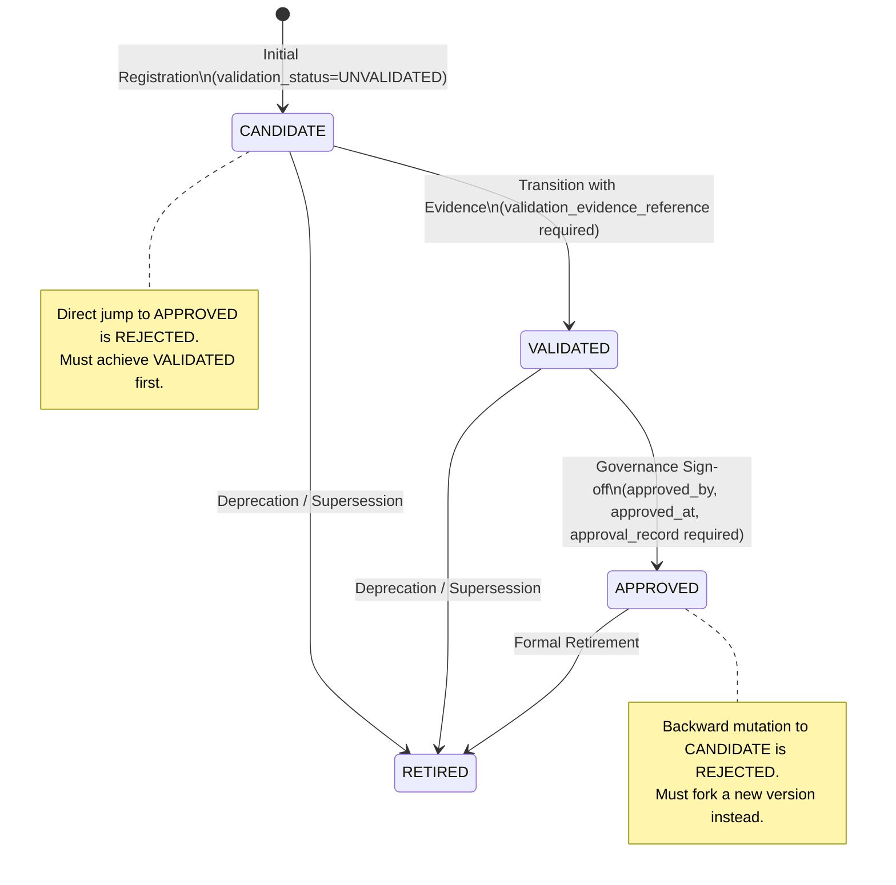

# YUKIRA — PHASE 2G: METHODOLOGY GOVERNANCE FOUNDATION

**Document Reference:** `phase2g_methodology_governance.md`  
**Status:** COMPLETED & VERIFIED FOUNDATION  
**Effective Date:** 2026-09-20  
**Core Axiom:** `IMPLEMENTED ≠ VALIDATED ≠ APPROVED PRODUCTION METHODOLOGY`

---

## 1. Executive Summary & Epistemic Foundations

In quantitative finance systems, computational implementations are frequently conflated with empirical validity. When a formula executes in code and produces numbers, teams often mistakenly treat the output as authoritative truth. In reality, an unverified formula merely demonstrates that the arithmetic runs, while implicit conventions—such as day-count bases, lookback boundary heuristics, or annualization rules—remain buried in procedural code.

In **YUKIRA**, methodology is governed as a first-class, versioned, relational, and auditable entity. No quantitative metric is approved merely because software can compute it.

### Authoritative Epistemic State as of Phase 2G:

```
IMPLEMENTED METHODOLOGY:           RET-02 CANDIDATE_V1
VALIDATED METHODOLOGY:             NONE
APPROVED PRODUCTION METHODOLOGY:   NONE
EMPIRICAL FINDINGS:                ZERO
```

- **RET-02 (Simple Period Return):** Strictly `CANDIDATE_V1` with lifecycle status `CANDIDATE` and validation status `UNVALIDATED`.
- **Validation Evidence:** `NONE` (`NULL`). No backtesting, stress testing, or peer-reviewed literature references have been claimed or fabricated.
- **Approval Record:** `NONE` (`NULL`). No approving actor, committee sign-off, or approval timestamp exists.
- **Empirical Findings:** `ZERO`. No performance claims or statistical distributions are asserted as proven.

---

## 2. Epistemic Classification Framework

To eliminate epistemic ambiguity across all system layers, every observation, assumption, algorithm, and output in YUKIRA is categorized under an explicit 6-tier taxonomy:

| Epistemic Tier | Formal Definition | Current YUKIRA Implementation Example |
| :--- | :--- | :--- |
| **1. FACT** | Immutable, verifiable observation received from an authoritative external source. | NAV on date $D$ from raw AMFI daily batch with verifiable SHA-256 ingest hash. |
| **2. ASSUMPTION** | Explicitly declared operational rule or parameter convention chosen to resolve data gaps. | 4-calendar-day lookback window to bridge weekend/holiday gaps on period return boundaries. |
| **3. CANDIDATE METHODOLOGY** | Implemented computational algorithm under active development, awaiting formal empirical validation. | `RET-02 CANDIDATE_V1` (discrete period return: $(NAV_{end} - NAV_{start}) / NAV_{start}$). |
| **4. VALIDATED METHODOLOGY** | Algorithm that has undergone verifiable empirical stress testing across market cycles with recorded evidence. | **NONE / STRICTLY EMPTY.** |
| **5. APPROVED METHODOLOGY** | Validated methodology formally signed off by human governance for production investor presentation. | **NONE / STRICTLY EMPTY.** |
| **6. FUTURE PLAN** | Architectural roadmap, planned metrics, or models not yet built or verified. | Metrics library expansion (remaining 29 MVP metrics), benchmark integration, portfolio risk attribution. |

---

## 3. Methodology Lifecycle & State Machine

A methodology progresses through a one-way, auditable state machine governed by explicit validation and approval gates:



### Transition Invariants & Enforcement:
1. **Rule 1 (Evidence Prerequisite):** `CANDIDATE → VALIDATED` strictly requires a non-blank `validation_evidence_reference`. Without verifiable evidence metadata, the transition is rejected.
2. **Rule 2 (No Unvalidated Approval):** A `CANDIDATE` methodology cannot transition directly to `APPROVED`. Transitioning `CANDIDATE → APPROVED` throws an `InvalidLifecycleTransitionException`.
3. **Rule 3 (Approval Sign-off):** `VALIDATED → APPROVED` strictly requires a formal `approval_record`, an explicit `approved_by` actor, and an `approved_at` timestamp.
4. **Rule 4 (No Backward Mutation):** Transitions `VALIDATED → CANDIDATE`, `APPROVED → CANDIDATE`, and `APPROVED → VALIDATED` are rejected. Any methodological adjustment requires creating a successor version.
5. **Rule 5 (Terminal Retirement):** Once a version is `RETIRED`, no further lifecycle transitions are permitted.
6. **Dual-Layer Enforcement:**
   - **Database Layer (Flyway V7):** Relational `CHECK` constraints enforce:
     - `chk_methodology_lifecycle_status`: Valid status values.
     - `chk_methodology_validation_status`: Valid validation values.
     - `chk_methodology_approved_requires_validation`: `lifecycle_status <> 'APPROVED' OR (validation_status = 'VALIDATED' AND approved_by IS NOT NULL AND approved_at IS NOT NULL AND approval_record IS NOT NULL)`.
     - `chk_methodology_validated_requires_evidence`: `validation_status <> 'VALIDATED' OR validation_evidence_reference IS NOT NULL`.
   - **Service Layer (`MethodologyGovernanceService`):** Enforces state transition validation, actor recording, and audit logging to `methodology_change_log`.

---

## 4. Immutability, Locking & Historical Reproducibility

### Immutability Semantics
- **Unused Candidate Methodology:** Remains mutable during initial configuration until either explicitly locked or used in a calculation.
- **Used Methodology:** The moment a `MethodologyVersion` is referenced by any `CalculationRun`, it becomes permanently **locked** (`is_locked = TRUE`).
- **Locking Meaning:**
  $$\text{LOCKED} \neq \text{VALIDATED} \neq \text{APPROVED}$$
  A locked methodology is an **immutable historical artifact**. A candidate version used historically is locked to ensure auditability, but remains strictly `CANDIDATE` and `UNVALIDATED`.
- **Enforcement:** Calling `updateMethodologyDefinition` on a locked or calculation-referenced version throws `MethodologyVersionLockedException`.

### Version Supersession & Forking
When a methodology needs parameter modifications or formula enhancements after being locked:
1. The historical version is **never modified in place**.
2. A successor version is created via `MethodologyGovernanceService.createNewVersion(...)`.
3. The successor version:
   - Receives a new version code (e.g., `CANDIDATE_V2`).
   - Starts strictly as `lifecycle_status = CANDIDATE` and `validation_status = UNVALIDATED`.
   - Links to its predecessor via `supersedes_version_id`.
   - Leaves the predecessor's `superseded_by_version_id` intact.
4. Historical calculation provenance is preserved: historical `CalculationRun` records remain attached to the exact predecessor version under which they executed.
5. **Empirical Verification:** Automated integration test `MethodologyGovernanceTest.testHistoricalReproducibilityAcrossMethodologyVersionFork()` explicitly proves that historical calculations rerun against the predecessor version produce identical results, while new calculations run against the successor version without mutating historical runs.

---

## 5. Validation Evidence & Approval Semantics

- **Validation Evidence Reference:**
  `validation_evidence_reference` is governance metadata pointing to external, auditable documentation (e.g., empirical backtest report URI, paper DOI, or test dataset hash). The presence of this string is a prerequisite for governance status transitions, but the system **does not mistake the string reference for empirical proof itself**.
- **Governance Approval Record:**
  Approval requires formal sign-off metadata (`approval_record`, `approved_by`, `approved_at`). YUKIRA strictly prohibits fabricating approval committees, placeholder actors, or dummy sign-off dates.

---

## 6. Phase 2F Preservation & Data Pipeline Integrity

Phase 2G preserves all Phase 2F baseline capabilities and fixes identified ingestion edge cases:
1. **Authoritative Point-in-Time (PIT) Semantics:**
   The 8-step resolution rule is strictly preserved:
   - Identify logical observation $(scheme\_option\_id, effective\_date)$.
   - Restrict to availability $\le knowledge\_cutoff$.
   - Determine maximum eligible availability timestamp.
   - Preserve all candidates at that timestamp.
   - Tie-break identical candidate values deterministically.
   - Flag conflicting candidates as `SUSPICIOUS/CONFLICTING` without silent discard. No `DISTINCT ON` regression.
2. **6-Dimensional Quality Taxonomy:**
   Preserves: `Quality` (VALID, INVALID, SUSPICIOUS), `Verification` (VERIFIED, UNVERIFIED), `Revision` (ORIGINAL, REVISED, SUPERSEDED), `Freshness` (CURRENT, STALE), `Presence` (AVAILABLE, MISSING, NOT_APPLICABLE), and `Integrity` (DUPLICATE, CONFLICTING).
3. **AMFI ISIN-Resolution Precedence Fix:**
   In `AmfiNavIngestionService`, multiple scheme options can share an AMFI scheme code while maintaining distinct ISINs (e.g., Growth vs. IDCW). The ingestion engine enforces:
   - Exact ISIN match takes absolute precedence.
   - If a record has a conflicting non-empty ISIN, it is never assigned via fallback scheme code matching.
   - Scheme code fallback occurs only when no conflicting ISIN exists.
   - Verified via unit test `AmfiNavIngestionServiceTest.testIsinMatchingPrecedenceAndConflictingIsinProtection()`.
4. **Integration Test Isolation:**
   `AmfiRealDataIntegrationTest` utilizes entity-scoped cleanup (`findBySchemeOptionId`) to ensure clean test runs without deleting unrelated data or weakening PIT assertions.

---

## 7. Governed Metric Specification: RET-02

The discrete simple period return metric `RET-02` is formally documented across 20 relational dimensions:

| Dimension | Governed Specification |
| :--- | :--- |
| **1. Metric Code** | `RET-02` |
| **2. Metric Name** | Simple Period Return |
| **3. Analytical Dimension** | `RETURNS` |
| **4. Metric Category** | `PERFORMANCE` |
| **5. Mathematical Definition** | Discrete return: $(NAV_{end} - NAV_{start}) / NAV_{start}$ |
| **6. Formula Reference** | Standard discrete financial return (Bacon, 2008) |
| **7. Required Inputs** | Historical NAV observations for `scheme_option` at start and end dates |
| **8. Units** | `PERCENTAGE` |
| **9. Frequency** | `DISCRETE_PERIOD` (boundary-resolved from daily observations) |
| **10. Lookback Window** | Candidate window up to 4 calendar days preceding requested boundary date |
| **11. Observation Semantics** | `EFFECTIVE_DATE_AS_OF_BOUNDARY` |
| **12. Information Set / PIT** | Strictly $T \le \text{knowledgeCutoffTime}$; latest eligible availability |
| **13. Annualization Convention**| `NONE` (discrete period return is unannualized) |
| **14. Denominator Convention** | `STARTING_NAV` |
| **15. Missing Data Rule** | Look back up to 4 calendar days; if none found, halt with `INSUFFICIENT_EVIDENCE` |
| **16. Insufficient History Rule**| Both boundaries must resolve; otherwise halt with `INSUFFICIENT_EVIDENCE` |
| **17. Invalid Data Rule** | $NAV \le 0$ rejected as `INVALID`; authority conflict halts with `SUSPICIOUS/CONFLICTING` |
| **18. Quality Prerequisites** | Observations must be `VALID` or pass lookback triage without unresolvable ambiguity |
| **19. Benchmark Dependency** | `FALSE` (Standalone single-asset calculation; `benchmark_id = null`) |
| **20. Risk-Free Dependency** | `FALSE` (No risk-free rate subtracted) |

---

## 8. Out-of-Scope Declarations (Boundary Preservation)

In strict adherence to project boundaries, the following capabilities are explicitly **excluded** from Phase 2G:
- **Scoring Systems:** No scheme scoring, opportunity scoring, or risk scoring.
- **Investment Recommendations:** No BUY, HOLD, SELL, or AVOID signals.
- **Forecasting / Predictions:** No forward-looking predictive models or extrapolation.
- **Portfolio Ranking:** No comparative ranking across mutual fund schemes.
- **Benchmark Ingestion:** No benchmark index data pipelines or comparisons.
- **Expanded Metric Library:** No premature expansion to the remaining 29 MVP metrics before governance validation.
- **AI Authority:** No AI generation or approval of numerical financial computations.
